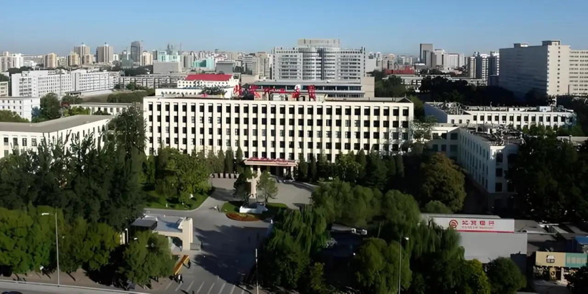

为了方便广大师生在暑期合理安排学习与生活，现将朝阳校区餐饮、学生公寓、楼宇物业、商贸、医疗、场馆及修缮等各项服务保障安排汇总如下：

## 01 餐饮服务

| 食堂名称 | 营运状态 | 营业时间 |
| :--- | :--- | :--- |
| **东一食堂** | 7月25日至8月27日暂停营业 | - |
| **东四食堂** | 7月25日至8月27日暂停营业 | - |
| **东二食堂** | 正常营业 | 中午 10:30-13:30 晚上 16:30-20:00 |
| **东三食堂** | 正常营业 | 中午 10:30-13:30 晚上 16:30-19:00 |
| **东五食堂** | 正常营业 | 早餐 06:30-09:00 中午 10:30-13:30 晚上 16:30-21:30 |
| **东民族食堂** | 正常营业 | 早餐 07:00-08:30 中午 11:00-13:30 晚上 16:30-20:00 |
| **东六食堂** | 8月1日至8月23日暂停营业 | - |

---

## 02 学生公寓服务

### 1. 门禁与开放时间
* **学生宿舍 1 至 4 号楼**：实行 24 小时门禁系统（如有变化另行通知）。
* **学生宿舍 6 号楼（南厅、北厅）**：开放时间为 `6:00 - 23:00`（如有变化另行通知）。
* **洗浴服务**：正常开放，开放时间为 `12:00 - 23:00`。
* **自助洗衣**：正常开放（如有变化另行通知）。

### 2. 公寓值班室联系电话
有特殊情况可前往公寓值班室咨询：

| 宿舍楼 / 位置 | 值班室电话 |
| :--- | :--- |
| **1 号楼值班室** | `64433285` |
| **2 号楼值班室** | `64433951` |
| **3 号楼值班室** | `64434950` |
| **4 号楼值班室** | `64434948` |
| **6 号楼南厅值班室** | `64437317` |
| **6 号楼北厅值班室** | `64437319` |

---

## 03 楼宇物业服务

| 楼宇/设施名称 | 开放状态与时间 | 备注 |
| :--- | :--- | :--- |
| **教学楼** | 7月25日至8月27日 停止开放 | - |
| **科技大厦东配楼** | 7月9日至8月27日 停止开放 | - |
| **科技大厦主楼及西配楼** | 正常开放 | - |
| **高精尖大厦** | 正常开放 | - |
| **收发室** | 正常开放（`8:30-12:00` / `13:30-15:00`） | 地点：南门内东侧 |
| **图书馆** | 7月25日至8月27日 正常开放（`8:00-22:00`） | - |

---

## 04 商贸服务

| 店铺名称 | 暑期营业安排 |
| :--- | :--- |
| **文印店** | • 7月25日至8月2日：正常营业 • 8月3日至8月27日：营业时间 `9:00 - 17:00` |
| **食堂西侧水果店** | 7月25日起暂停营业 |
| **定点帮扶专区** | • 7月25日至8月13日：每周二、四 `9:00 - 17:00` • 8月14日至8月26日：暂停营业 |
| **超市地上店** | 7月25日至8月27日：营业时间 `9:00 - 22:00` |
| **虎头军煎饼** | 7月25日至8月28日：营业时间 `9:00 - 22:00` |
| **超市 6 号楼地下店** | • 7月25日至7月30日：`9:00 - 22:00` • 7月31日至8月25日：暂停营业 • 8月26日至8月27日：`9:00 - 17:00` |
| **快递驿站** | 7月25日至8月28日：营业时间 `10:00 - 17:00` |
| **理发店** | 7月25日至8月27日：营业时间 `9:30 - 21:00` |
| **化妆品店** | 7月25日至8月27日：暂停营业 |
| **水站** | 正常营业 |
| **联通营业厅** | 7月25日至8月20日：暂停营业 |

---

## 05 医疗服务

### 1. 门诊服务
* **开放时间**：
  * **7月27日至7月31日**：每天开放
  * **8月1日至8月27日**：每周二、周四开放（上午 `8:00-11:30`，下午 `13:30-17:00`）
* **服务范围**：提供诊疗及部分药品服务，**无化验、检查等服务**。

### 2. 应急值守
* **服务时间**：除门诊时间外，均为应急值守时间。
* **服务内容**：为急性疾病提供病情初评和紧急处置（仅提供应急药品服务）。
* **注意事项**：急性疾病患者也可直接前往合同医院急诊科就医，或拨打 `120` 急救电话。
* **服务地点**：校医院急诊室（109室）
* **联系电话**：`64434832`

---

## 06 场馆服务

* **朝阳校区**：投入使用的运动场馆均**正常开放**。

---

## 07 修缮服务

如遇宿舍或公共区域设施故障，可通过以下方式报修：

* **维修服务热线**：`64432833`
* **网络报修平台**：打开 `企业微信` &rarr; 点击 `北化修匠` &rarr; 选择 `网络报修`