---
title: 奖学金与助学金体系
tags:
  - 奖学金
  - 助学金
  - 资助
  - 学习
description: 北化资助育人体系介绍
---

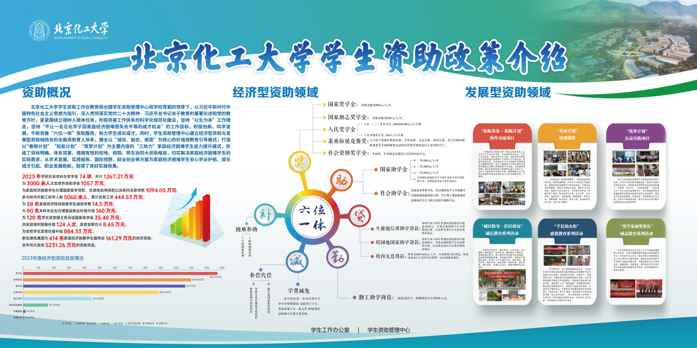

## 入学报到前

### 生源地信用助学贷款

生源地信用助学贷款是指国家开发银行或生源地经办银行向符合条件的家庭经济困难学生发放的、在学生入学前户籍所在县（市、区）办理的助学贷款。学生和家长（或其他法定监护人）为共同借款人，共同承担还款责任。助学贷款期限为学制加 15 年，最长不超过 22 年。同时设立还本宽限期，最长为 5 年，宽限期内只需支付利息，不需要偿还本金。助学贷款利率按照同期同档次贷款市场报价利率（LPR）减 70 个基点执行，在校期间利息由财政补贴。

生源地信用助学贷款按年度申请、审批和发放。学生在新学年开始前，向家庭所在县（市、区、旗）的学生资助管理中心提出贷款申请。县级学生资助管理中心负责对学生提交的申请进行资格审查，银行负责最终审批并发放贷款，贷款将优先用于支付在校期间学费和住宿费，超出部分可用于弥补日常生活费。该贷款为信用贷款，不需要担保或抵押，本科生每人每年最高可贷款 20000 元，研究生每人每年最高可贷款 25000 元。

## 入学报到时

### 绿色通道

为保障家庭经济困难新生顺利入学，学校专设“绿色通道”。家庭经济困难的新生可提前在线上或在开学报到时，通过绿色通道申请床上用品、生活用品、爱心教材、伙食补贴、缓交学费住宿费、通讯礼包、助航基金等相关资助。

#### 资助项目

1. **床上用品**：包含枕头、床褥、床垫、被子、床上三件套、蚊帐，可以满足学生宿舍入住需求。
2. **生活学习用品“爱心礼包”**：包含收纳箱、生活衣架、脸盆、抽纸、香皂、皂盒、牙具、毛巾、洗发水、洗衣粉、水杯、晴雨伞、作业纸、订书机、燕尾夹、跳绳等新生入学初期所需的生活学习必需品。
3. **爱心教材**：通过“学长的火炬”活动收集，经过消杀、分类、整理得到的书籍，包含大一至大四期间可能用到的部分课本教材和课外书籍。
4. **伙食补贴**：现场登记即可办理，补贴 200 元将直接充入学生校园卡。
5. **缓交学费**：因家庭困难可申请缓交学费，该项目可报到现场直接办理。
6. **通讯礼包**：现场登记即可领取通讯优惠礼包。
7. **新生“助航基金”**：由北京化工大学教育基金会设立，帮助和支持家庭经济困难新生顺利适应大学生活。该项目不需要学生申请，学校将根据学生情况直接发放。
8. **绿色通道受灾学生专享补贴**：为受到紧急灾害影响的同学发放补贴。
9. **其他**：其他资助项目可在报到当天学院绿色通道窗口申请办理。

**申请时间**：线上申请时间每年由企业微信学工办发通知，辅导员也会在班级群转发通知。

#### 学生申请流程

1. 加入“北京化工大学”企业微信。
2. 手机端/校外网：手机微信 - 通讯录 - 北京化工大学企业号 - 办事大厅。

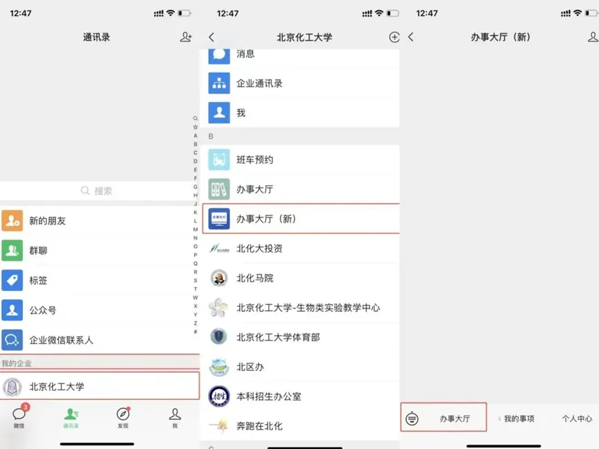

手机端/校外网：企业微信 APP - 工作台 - 办事大厅。

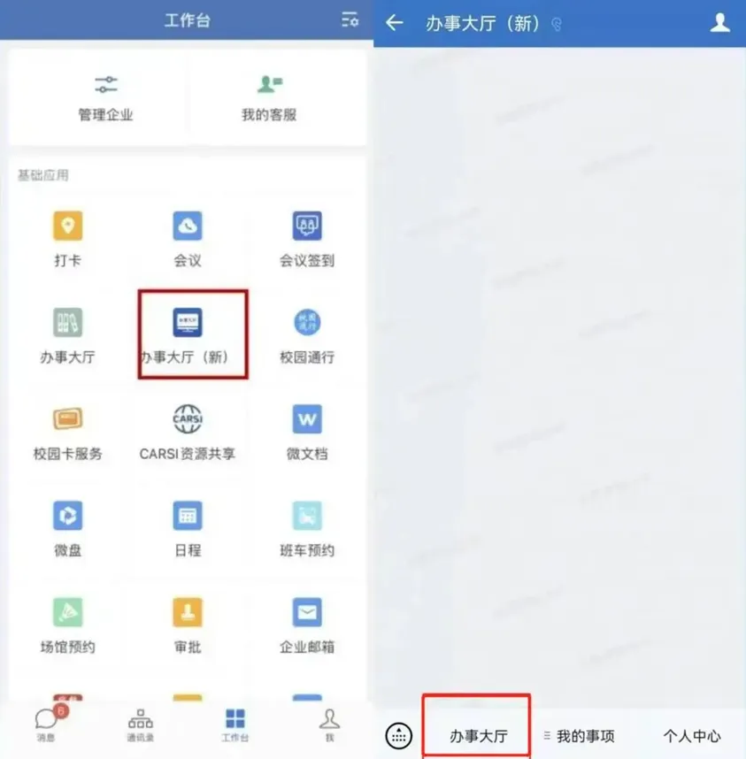
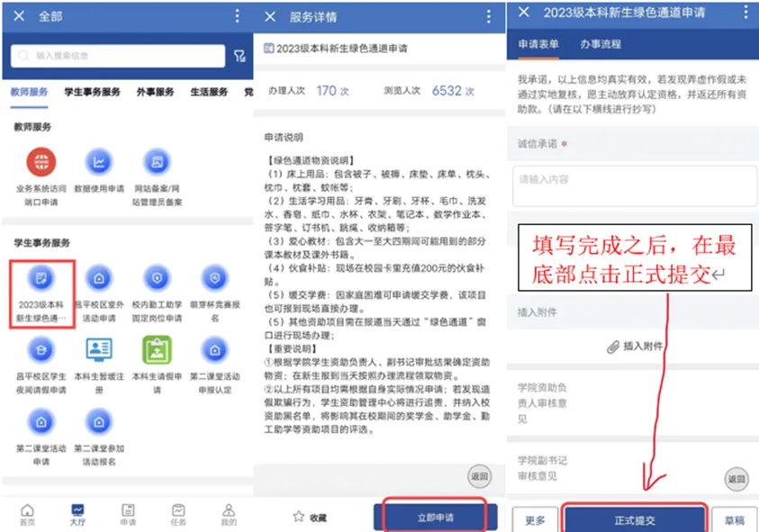

电脑端：数字校园 / 办事大厅。[数字北化](http://my.buct.edu.cn/)（校园网）；[办事大厅](http://service.buct.edu.cn/)（校园网）。

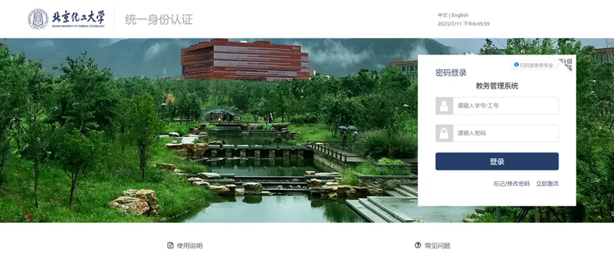
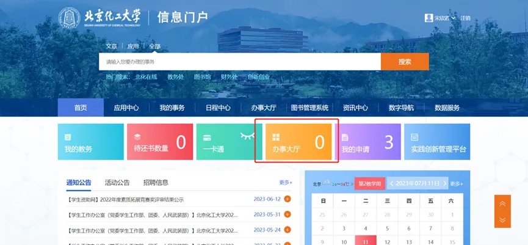
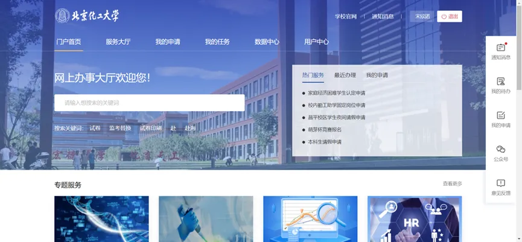

3. 学生申请：
   - 学生可以采用以上任意一种方式进行申请，手机版和电脑端内容一致（电脑端更方便操作）。
   - 点击“本科新生绿色通道申请”按钮进入申请界面。
   - 按要求完成申请信息的填写，并及时提交申请。
   - 关注申请流程，查看节点审批人；若流程长时间未审核，可通过企业微信联系审核人进行催办。
4. 当天现场办理流程：
   - 若审批通过，学生可在报到当天按照“新生绿色通道办理流程”到指定地点领取相应材料和物资。
   - 若审批被驳回，建议先联系院（系）资助负责人说明情况，后续按照审批结果和备注进行修改、再次提交申请。

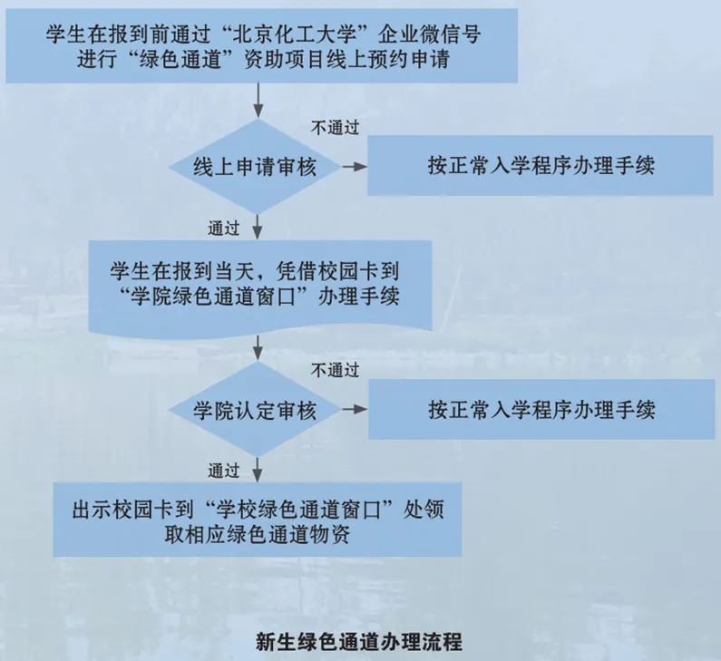

## 入学报到后

### 奖学金

#### 国家奖学金

国家奖学金面向全国普通高校全日制在校学生设立的荣誉最高、奖金额度最大的国家级奖学金项目。奖励标准为每人每年 10000 元，获奖人数约占全校学生总数的 0.8%。

申请国家奖学金的在校学生，要求其符合人民奖学金评定条件，在本专业综合成绩排名和学业成绩排名均达到前 8%；获得过院级以上荣誉称号或在课外活动中有突出表现者优先，对学校和国家有特殊贡献者优先。

对于学习成绩和综合考评成绩没有进入前 8%，但达到前 30% 的学生，如在其他方面表现非常突出，可申请国家奖学金，但需提交详细的证明材料。其他方面表现非常突出是指在道德风尚、学术研究、学科竞赛、创新发明、社会实践、社会工作、体育竞赛、文艺比赛等某一方面表现特别优秀。

#### 国家励志奖学金

国家励志奖学金由中央财政拨款出资设立，用于奖励资助纳入全国招生计划内的高校全日制本专科学生中品学兼优的家庭经济困难学生。奖励标准为每人每年 6000 元。

申请国家励志奖学金的在校学生，需要通过家庭经济困难学生认定，要求其符合人民奖学金评定条件，且在本专业综合成绩排名和学业成绩排名均达到前 35%；获得过院级以上荣誉称号或在大学生素质拓展活动中有突出表现者优先。

#### 社会资助奖学金

社会资助奖学金是由企事业单位、社会团体及个人等捐赠方自愿向学校捐资设立的奖学金，用于奖励学校品学兼优、综合素质全面的学生。2025 年总金额已达 1185.56 万元，共 64 项奖项。

参评人员：
- 全日制在读本科生、硕士及博士研究生（依据不同奖项要求）。
- 申请学生须符合人民奖学金的基本条件和各项社会资助奖学金的其他申请条件要求。

具体奖项会有具体的申请要求和评审流程，相关通知具体见每年北化资助微信公众号的推送文章与企业微信学工办的推送通知。

#### 人民奖学金

人民奖学金是由学校出资设立的，奖励成绩优秀、综合能力较高的学生。设有人民一等奖学金、人民二等奖学金、人民三等奖学金、人民单项奖学金。

| 奖项 | 金额 | 最高比例 |
| --- | --- | --- |
| 人民一等奖学金 | 1000（元/学期/人） | 占同专业同年级总人数的 2% |
| 人民二等奖学金 | 600（元/学期/人） | 占同专业同年级总人数的 7% |
| 人民三等奖学金 | 400（元/学期/人） | 占同专业同年级总人数的 10% |
| 人民单项奖学金 | 300（元/学期/人） | 占同专业同年级总人数的 3% |

人民奖学金的成绩评定包括学习成绩和第二课堂成绩，其中学习成绩占 70%，由教务处负责评定；第二课堂成绩占 30%，由各院（系）和学生工作办公室负责评定。

#### 素质拓展竞赛奖

素质拓展竞赛奖由学校出资设立，专门用于奖励在科技竞赛、学科竞赛、文艺比赛、体育比赛、社会实践和创新创业等方面的课外活动评比中获得省部级及以上荣誉的学生。考评学期受到学校纪律处分的，不能参评素质拓展竞赛奖。

评审范围为当年的 1 月 1 日到 12 月 31 日，时间范围之前的不再进行申请，时间范围之后的将在明年评审，分为集体奖（团队奖项的申请需要每名成员独立申请）与个人奖。不同类别奖项需不同部门审批，学生需正确填报奖项和评审部门，该奖项择优获奖，根据学生获奖级别、竞赛等级和参赛团队人数等不同，设置不同奖学金等级。

#### 奖学金兼得

- 国家奖学金、国家励志奖学金、社会资助奖学金相互之间不能兼得。
- 人民奖学金除一等奖可兼得一项社会资助奖学金外，其他均不可与国家奖学金、国家励志奖学金、社会资助奖学金兼得。
- 素质拓展竞赛奖可以和任何奖学金兼得。

### 助学金

#### 国家助学金

国家助学金由中央财政拨款出资设立，用于资助全日制在校正式注册并参加正常学习且已通过本学年家庭经济困难认定的本科生。其中，全日制在校退役学生全部享受本专科生国家助学金，资助标准为每人每年 3700 元。

| 国家助学金等级 | 资助标准（元/人/年） | 备注 |
| --- | --- | --- |
| 一等 | 4400 | 只面向家庭经济困难认定为特困的学生 |
| 二等 | 3400 | 无 |
| 三等 | 2500 | 无 |

注：在同一学年内，申请并获得国家助学金的学生，可同时申请国家奖学金、国家励志奖学金或其他各项奖学金。

#### 社会助学金

社会助学金是由企事业单位、社会团体及个人等捐赠方自愿向学校捐资设立的，用于资助家庭经济困难学生的专项资助。具体奖项详见每年北化资助微信公众号推文介绍。

注意事项：
- 各院（系）需坚持公平、公正、公开的原则进行校级社会助学金的初评工作。
- 原则上每名学生最多可申请一项校级社会助学金。
- 评定过程中，脱贫家庭学生、脱贫不稳定家庭学生、边缘易致贫家庭学生、突发严重困难学生、低保户、低保边缘人口、特困供养、支出型困难家庭学生、其他低收入家庭学生、孤儿、事实无人抚养儿童、残疾学生优先。
- 受助学生一经确定，应避免变更，如遇特殊情况，应向基金会说明，并提供相关书面依据。
- 受助学生出现以下情形之一者，将终止资助：
  1. 因特殊原因，不能继续学业者。
  2. 违反法律或校规校纪、受到处分或在申请材料中弄虚作假，受到举报者。
  3. 有其他重大品行问题者。
  4. 其他不符合助学金继续资助条件者。

#### 国家助学贷款

国家助学贷款分为生源地信用助学贷款（在户籍所在地办理）和校园地国家助学贷款（在高校办理），两类贷款不可以同时申请。多数同学选择生源地贷款，暑假期间在户籍所在地县级学生资助管理部门即可办理。具体在文章第一个生源地信用助学贷款已介绍。

校园地国家助学贷款是由中国银行面向在校家庭经济困难学生提供的助学贷款，用于帮助学生支付在校期间学费和住宿费及部分生活费的信用贷款。家庭经济困难新生可通过中国银行手机银行，线上申请选择生源地助学贷款或校园地助学贷款进行办理，也可先通过绿色通道缓交学费办理报到手续入学后再申请办理校园地助学贷款。申请时需要提供学生本人的身份证以及家庭经济困难认定申请表。贷款额度和利率与生源地信用助学贷款相同，本科生每人每年最高可申请 2 万元，研究生每人每年最高可申请 2.5 万元。贷款利率为同期同档次 LPR 减 70 个基点，在校期间利息由财政全额补贴，不需要承担任何利息。

#### 校内无息借款

校内无息借款是由学校提供的小额短期无息借款，是帮助解决学生经济困难的途径之一。我校本科所有家庭经济困难学生均可申请，家庭经济困难学生有申请校内无息借款的权利，也有偿还校内无息借款的义务。

校内无息借款每学年初审批一次，原则上第二学期不再受理与变更。学生申请借款每年分两次发放。

申请条件：
- 具有完全的民事行为能力。未满 18 周岁的学生须由其法定监护人书面同意，且有父母、亲属或其他具有完全民事行为能力的人提供担保。
- 通过该学年学校家庭经济困难认定。
- 生活节俭，学习刻苦，成绩较好。
- 身体健康，能够顺利完成学业。
- 没有违法、违规、违纪行为，没有受到学校纪律处分。
- 承诺正确使用所借款项，并按规定严格履行还款义务。
- 积极参加勤工助学活动。

资助标准：
- 一等每人每学年 2000 元。
- 二等每人每学年 1500 元。

减免政策：借款学生自借款获批至签署还款协议期间满足以下情形的，在还款时经学生本人申请，学校审核批准，可获得相应的借款减免。

1. 符合下列条件之一的学生，可申请免还全部校内无息借款：
   - 在校期间受到北京市级以上表彰奖励，被授予市级“三好学生”“优秀学生干部”“优秀团员”等先进称号的。
   - 赴基层就业的毕业生获得“到基层工作”荣誉证书的（具体评定标准以当年学校公布为准）。
2. 毕业时一次还清全部借款的学生，可减免其借款额的 10%。
3. 毕业时一次还清全部借款且符合下列条件之一的学生，可再减免部分借款：
   - 在校期间，荣获“三好学生”“优秀学生干部”“优秀团员”等称号的学生。

   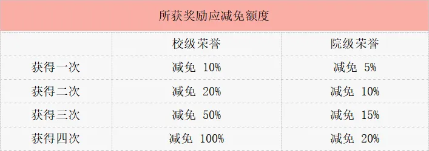

   - 同一学年中所获荣誉有校、院两级的，只取一次最高级别荣誉计算减免比例。
   - 在校期间考取基本能力或专业能力证书的学生（荣誉等级和证书类型明细以还款当年通知为准）。

   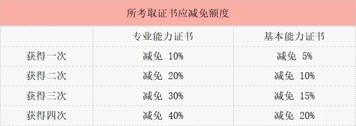

   - 荣获过校级或院级任一种荣誉一次以上，且本科毕业时考取本校研究生（含保送研究生）的学生，可减免其借款额的 20%。

### 勤工助学

勤工助学是指学生在校就读期间，在学校的组织下利用课余时间，通过劳动取得合法报酬，用于改善学习和生活条件的实践活动。

根据学校用工部门的需要，学校勤工助学中心协助设立相应的校内勤工助学岗位。每学年开展“校内勤工助学岗位双选会”，为学校用工部门设立的固定岗位招聘学生，岗位涉及全校 20 余个机关部门和 13 个院系，涵盖教学助理、科研助理、行政管理助理、公共服务助理、校园监督等各种岗位。

#### 勤工助学事项

1. **岗前培训**：学生资助管理中心统一举办勤工助学岗位知识培训会后，领取工作证上岗。
2. **绩效考评**：校内勤工助学工作每月会由部门老师对学生进行考评。考评级别分别为“优秀、良好、合格、不合格、离岗”，考评获得“良好”及以上，工资即可获得不同等级的适当上浮。
3. **“校内勤工助学岗位能手”评选**：为奖励学生在勤工助学过程中的出色表现，激励参与勤工助学工作的同学端正态度，每学期开展“校内勤工助学岗位能手”评选活动，根据申请学生的材料初审得分、线上投票、答辩环节和教师评分加权计分，最终根据结果为岗位能手颁发荣誉证书，获得校内无息贷款的减免资格，发放奖励金。

#### 校内勤工助学岗位双选会

1. 同学携带简历（建议携带与面试次数相同数量的个人课表）到双选会现场，寻找已申请或感兴趣的岗位所在的部门，投递简历，进行面试。
2. 面试次数不做数量要求，同学可根据自身情况酌情携带简历数量；但一个人最终只能被一个固定岗位录取。
3. 试用期/培训期时间根据各部门安排，在此期间，同学需到应聘部门参与岗位工作，提前适应工作内容；各部门需开展岗前培训工作，并确认最终上岗名单。
4. 招聘对象为有意愿参与勤工助学、表现良好并且无不良记录的在校本科生和研究生。
5. 通过本学年家庭经济困难认定的同学优先录取（建议在简历中注明相关情况）。

### 学费减免

学费减免是学校针对孤残、少数民族、烈士子女、优抚家庭子女等家庭经济条件特别困难的学生实施全额或部分减免学费的资助措施。减免金额按学生本学年应缴纳的学费（不含住宿费和其他费用）分为全额减免与半额减免两档，原则上不超过 8000 元。

在该学年家庭经济困难认定中被认定为家庭经济特别困难且符合下列条件之一的本科生（含预科生和第二学位学生），可申请该年度学费减免：

- 学生本人为烈士子女或优抚家庭子女；
- 学生本人为残疾或患有重大疾病，有较大开销者；
- 学生本人为孤儿，无法承担上学费用者；
- 学生家庭为单亲家庭，且供养人残疾或患有重大疾病、无固定收入来源者；
- 学生父母均患有重大疾病、无劳动能力，且共同生活的直系亲属因病有较大开销，家中无法承担上学费用者；
- 学生本人为少数民族，且家庭遭遇自然灾害或突发事件、无法承担上学费用者；
- 其他按国家规定允许予以减免学费的情况。

**评选依据**：
- 学习态度端正，学习成绩优秀，必修课程无不及格记录；
- 积极参加勤工助学活动、志愿服务和公益劳动，表现突出；
- 生活简朴，节约粮食，无不良嗜好；
- 无违反国家法律法规、学校规章制度的行为；
- 经学校审核，学生家庭收入低或无固定经济收入，学生本人确实无法筹集学费。

### 困难补助

困难补助包括专项困难补助和临时困难补助两部分。专项困难补助是由国家或学校对家庭经济困难学生提供的专项资助；临时困难补助是由学校提供的，用于帮助学生解决特殊情况导致的突发性、临时性、特殊性的经济困难。随着资助力度的不断增加，学校密切关注重大灾害或学生家庭突发性事件的发生，通过困难补助帮助家庭经济困难学生渡过难关。

## 毕业离校后

### 毕业生基层就业学费补偿和国家助学贷款代偿

毕业生到中西部地区和艰苦边远地区基层单位就业、服务期在 3 年以上（含 3 年）的，其学费由国家实行补偿。在校学习期间获得国家助学贷款的（含高校国家助学贷款和生源地信用助学贷款，下同）代偿的学费优先用于偿还国家助学贷款本金及其全部偿还之前产生的利息。学生申请受理、材料初审、具体发放由学校负责，学校依据教育部全国学生资助管理中心批复名单进行发放，学费补偿和国家助学贷款代偿所需资金由中央财政出资。

我校具体申报流程见北化资助微信公众号推文（搜索“毕业生基层就业学费补偿国家助学贷款代偿”即可查询到最新发表的相关文章）。

### 服兵役学生国家教育资助

服兵役学生国家教育资助（以下简称入伍资助），是指对应征入伍服义务兵役、招收为士官的学校学生，在入伍时对其在校期间缴纳的学费实行一次性补偿或获得的国家助学贷款实行代偿；对应征入伍服义务兵役前正在我校就读的学生（含按国家招生规定录取的高校新生），服役期间按国家有关规定保留学籍或入学资格、退役后自愿复学或入学的，实行学费减免；对退役一年以上，通过全国统一高考或高职单招考入我校并到校报到的入学新生，实行学费减免。本科生每人每年最高不超过 16000 元。

## 发展型资助育人项目

### “拓航基金-拓航计划”海外交流项目

学校积极为家庭经济困难学生搭建拓展国际视野的平台，通过完善的经费保障、选拔培训、海外学习交流、项目反馈等工作流程，根据家庭经济困难学生特点，打造满足学生发展性需求为目标的“拓航基金-拓航计划”海外交流访问项目。

“拓航基金-拓航计划”项目由北京化工大学学生工作办公室发起，并由校教育基金会、学生工作办公室、国际交流与合作处、国际教育学院联合主办的家庭经济困难学生海外学习交流活动。项目实施以来，截至 26 年 5 月已累计资助 200 余名优秀学子，先后赴美国加州大学戴维斯分校、爱尔兰都柏林大学、比利时皇家科学院、新加坡国立大学、新加坡南洋理工大学等知名院校，开展为期 2–3 周的短期海外研学交流。

**选拔条件**：
- 通过本学年家庭经济困难学生认定、学籍正式在册的我校大三、大四级本科学生。
- 爱党爱国、理想坚定，诚实守信、自信自强，勤俭节约、乐于助人，积极参与校内外公益活动，未受到过纪律处分和行政处罚。
- GPA 不低于 3.0，任一学年受到学校资助金额在 1 万元及以上（含各类奖助学金，不含助学贷款），其中获得过国家奖学金或国家励志奖学金者优先。
- 非英语专业学生达到英语四级及以上水平，英语专业学生达到专业四级及以上水平或持有其他社会英语考试认证，且需同时满足各项目要求。

**选拔流程**：本项目选拔分为“个人申报、资格审核、面试考核、校内公示”四个环节。

有意向且符合报名条件的同学，请于规定时间前（具体时间见每年具体通知），登录北京化工大学企业微信，在审批工作台提交《2026 拓航基金-拓航计划项目申请表》（仅以 26 年为例，实际每年表单名称可能会不同）完成自主申报。

学生资助管理中心将统一审核材料并另行通知面试相关安排，全程动态通知请持续关注“北化资助”微信公众平台。面试工作预计 6 月初前完成，考核形式包含无领导小组讨论、双语个人综合面试，具体时间与安排后续另行发布。

### “春雨计划”培训课程

“春雨计划”系列培训课程主要依托校内师资力量、校外培训机构、学生骨干力量建立培训队伍，根据家庭经济困难学生的实际需求，开展对应的培训课程，提高学生的综合素质，激发学生内在潜质，增强学生综合竞争力。学校每学期开设“春雨计划”课程，包含演讲与口才、公文写作、信息检索、电脑知识、摄影摄像、图像处理、英语口语、求职技能、礼仪仪表、茶艺文化、运动球类等 20 门类。

在不断丰富课程内容的基础上，学校注重课程互动性和实操性设计，加强课程考核和反馈的规范化管理，提升课堂效果。相关培训课程内容在北化资助微信公众号推文发布。

### “筑梦计划”公益实践项目

2023 年，我校成功承办中国乡村发展基金会公益未来“玛上 GO”校内赛，召集富有创意、热衷环保、敢于实践的北化青年学子参与公益实践活动；开展“暑期骨干培训班”项目帮助学员拓展视野、发散思维，全面提升综合素质；“送故事下乡”公益实践项目帮助贫困地区孩子接受早教，缩小他们与城市儿童学前教育的差距。

### “诚信教育”系列主题活动

学校每年开展以“诚以修身，信以致远”为主题的“诚信教育”系列活动，通过诚信主题班会、贷款政策宣讲会、网上诚信知识竞赛等活动载体，营造良好的校园氛围，普及征信知识，增强学生的诚信意识。倡导广大学子诚信为人、诚信处事、诚信应考、诚信学术、诚信用网、诚信求职、诚信离校、诚信还款，传递矢志奋斗、感恩奉献的青春正能量。

### “励志教育”系列主题活动

为学生全面讲解学校的学生资助体系，鼓励学生勤奋学习，努力拼搏；充分发挥各项资助金的效率，提高资助育人水平；举办奖学金颁奖典礼，不断激励北化学子见贤思齐、超越自我、卓越发展，发挥各类奖学金在学生培养过程中的教育引导作用，培育和激励学生的奋斗精神。

### “感恩教育”系列主题活动

“学长的火炬”爱心教材回收传递活动号召高年级学生将自己闲置的书籍和物品无偿捐赠给学弟学妹，传递知识力量，共建资源节约型校园。该活动将回收的书籍进行分类整理后，根据新生课程进行组合分装，通过新生入学“绿色通道”免费赠送给低年级家庭经济困难学生，帮助学生减轻经济负担；非课程类书籍通过整理后在校内建立“闲来书屋”供学生借阅；同时根据当年捐书情况开展“爱心送书活动”。所有书籍进行入库管理，方便学生了解书籍的来源和去向。自 2013 年启动以来，共传递爱心书籍约 10 万余本。

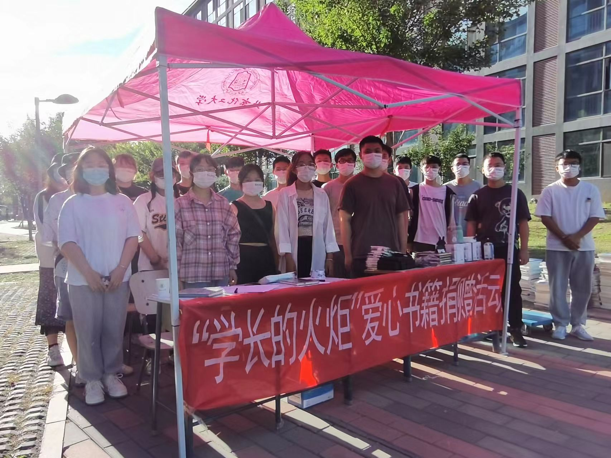

## 附录

参考内容部分来源于 [北京化工大学学生资助网](http://zizhu.buct.edu.cn/) 内一篇于 24 年整理的奖助学金体系合集，但一些数据与 24 年有所出入，所以本文章参考截至 26 年 8 月份企业微信学工办推文及北化资助微信公众号的推文对相关最新政策与数据做了整合。每年实际数据仍应以这两个渠道发布的最新消息为准，此文章仅供参考。

部分来源于学工办推文：

- 开学季｜@萌新们，这份本科新生绿色通道申请指南请收好！
- 你好，这份本科生国家助学金申请通知请查收！
- 希望这份无息借款，能助力你的大学学习生活。
- 这有一份勤工助学双选会邀请函，请查收！
- 希望学校的这份学费减免制度，能帮助有需要的你。
- @全体在校本科同学，2026-2027 学年国家助学贷款信息采集启动啦。
- @全体北化学子 请注意！千万奖池已解锁！

北化资助微信公众号推文：

- 奖学金热度未减，助学金接力登场！
- 世界就在你眼前——第十期“拓航基金-拓航计划”海外交流项目选拔启动！
- 本科生奖学金政策解读，这份“宝藏”请收好！
- 让每一次课外闪光，都被看见 | 素质拓展竞赛奖申请通道已开启！
