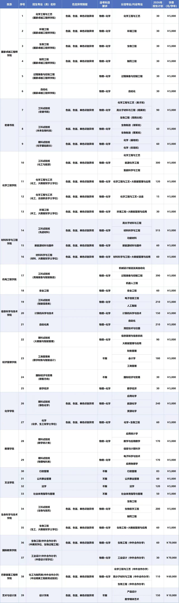

 
## 大类分流去向   
  
> 图片来源为北京化工大学招生办官方公众号  
## 大类分流流程  
- **成绩复议**  
  在大一学年第二学期期末成绩出来后，会以学院为单位进行成绩绩点以及分流资格排名公示，在规定时间内对有问题的科目成绩进行上报给相关负责人，相关教师将会进行成绩的复核。  
- **志愿填报**  
  在成绩没有异议的情况下，进行专业的志愿填报，采取遵循志愿的情况下，根据分流资格排名进行依次录取。  
- **分专业指标公示**  
  在志愿填报结束的前一天将会对各个分流专业的所需人数指标进行公示，同学们可以根据指标内容再次进行志愿的考虑。 
- **分专业结果公示** 
  在专业填报结束后的七个工作日内将会对专业的分流结果进行公示。
## 大类分流细则  
- **分流资格排名**  
  根据绩点高低进行初次排名，若绩点相同，则根据正考加权平均分进行比较，若正考加权平均分相同，则根据单科分数进行比较，具体科目的选定与学院差异相关，可以询问辅导员等。  
- **分流后班级查询**  
  分流后可以登录北京化工大学教务管理系统➡信息查询➡查询个人信息➡学籍信息，将学年更改为下一学年，即可出现分流后班级信息。  
- **分流时间**  
  在大一下期末考试成绩全部出来之后进行分流，一般会在学期结束前（即实践育人周结束之前）完成分流。  
- **分流对象** 
  一般以工科试验班、理科试验班等命名的大类招生需要涉及后续的分流。
