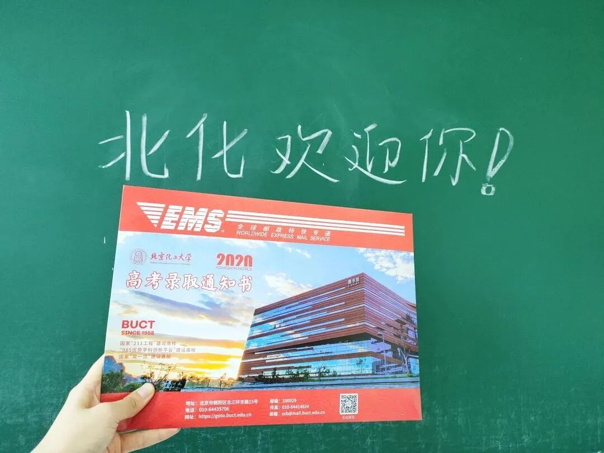
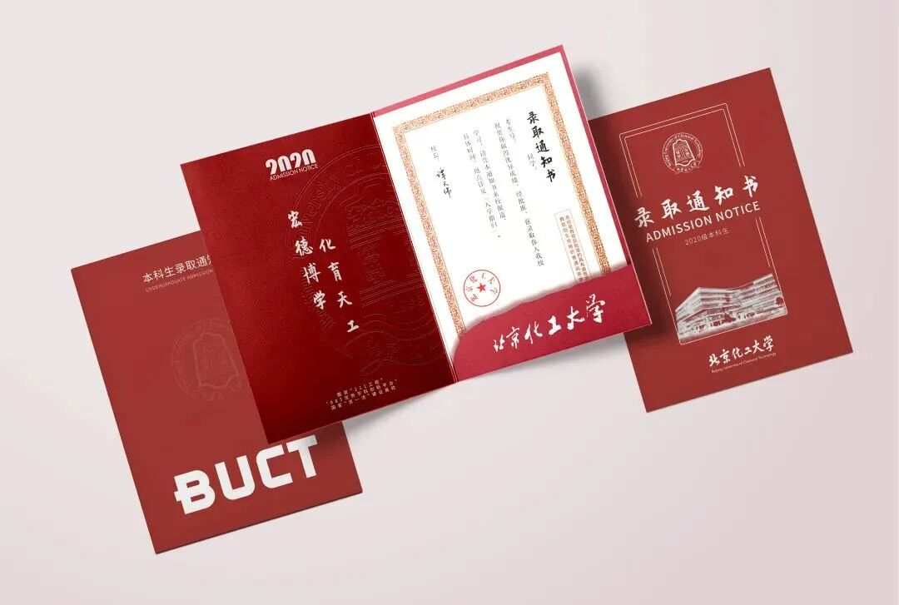
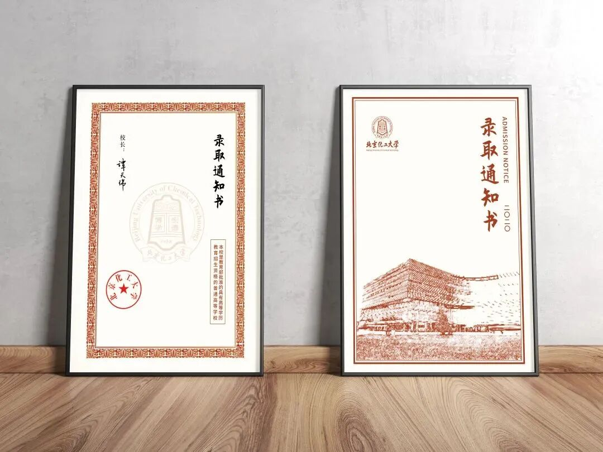
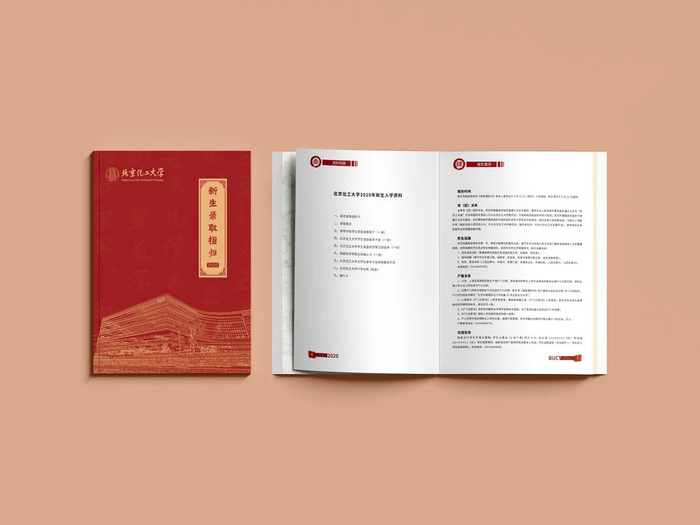

经年的渡口，在你一个清浅的回眸中，那是你无悔于在黑夜尚未消退的黎明晨起。山水为你而来，你的一点一滴都凝聚着北化的风采。

今天，要恭喜你们——**正式被北京化工大学录取！**

第一封录取通知书已经发出！遥寄纸笺，与你相约北化四度春秋，快来收下这封邀请函吧！

---

## 01 文化形象设计理念

北京化工大学 2020 版高考录取通知书文化形象设计，以高考录取通知书为核心，形成一个既具备高考录取功能又具有学校文化传播意义的文化设计体系。2020 版高考录取通知书包含：
* **文件夹**
* **录取通知书**
* **录取纪念卡**

### 1. 封面与色调寓意
* **封面元素**：主体元素由 **北京化工大学 LOGO** 与 **图书馆形象剪影** 组成，配以双层边框设计，形成“里程碑”形象，象征着高考结束的学子们为自己曾经的努力画上了圆满的句号，即将开始新的大学生活。
* **整体配色**：整体采用**绛红色**，与学子金榜题名的心情相得益彰。既表达了学校对学子的祝贺，又彰显了学校沉稳厚重、踏实内敛的朴实作风，同时展现了学校注重创新、引领前沿和北化人团结奋进、务实力行、争创一流、铸就辉煌的奋斗精神。

---

## 02 细节与校训元素解析

录取通知书封面内部展开，映入眼帘的是北京化工大学的校训——**“宏德博学，化育天工”**，希望北化学子不坠青云之志，胸怀理想，志存高远，不忘求学初心。

### 1. 内部设计亮点
* **校门石卡槽**：卡槽位置采用 **北京化工大学校门石** 的形象进行设计，表达了学校对 2020 级本科生的热烈欢迎，希望他们尽快融入到这个大家庭之中。
* **“麦花”纹饰**：录取通知书和录取纪念卡的四周缀以“麦花”纹饰，寓意收获满满，表达对北化学子的庆贺与祝福。
* **赤诚底衬**：纹饰采用绛红色底衬，蕴含了学校的办学初衷——办党和人民满意的教育，对祖国和人民的教育事业赤诚忠贞。

> **“2020”**，与北化四年携手；  
> **“爱你爱你”**，与北化情系一生。

---

## 03 高考录取指归

“指归”即主旨和意向，意为将这部《高考录取指归》作为架起学生与大学之间的“虹桥”，引导学生走进大学，开始大学生活。

2020 版高考录取指归采用**深红色封面封底设计**，并添加**图书馆剪影**，意在鼓励广大北化新学子勤勉好学、笃行不怠。

