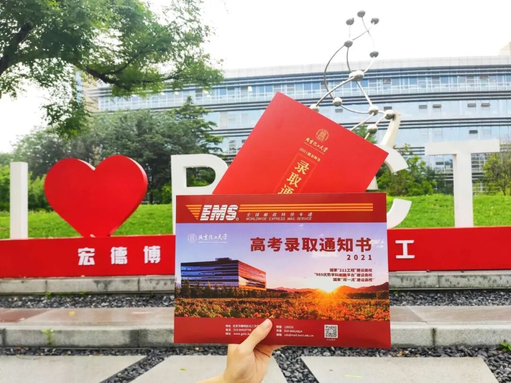
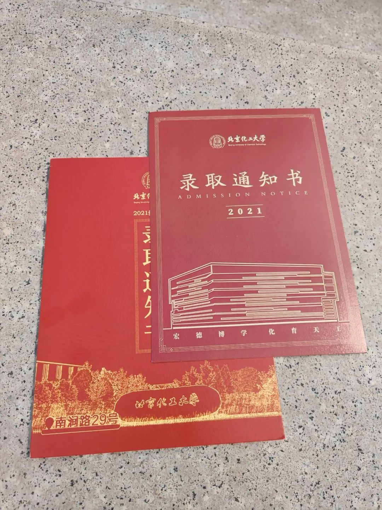
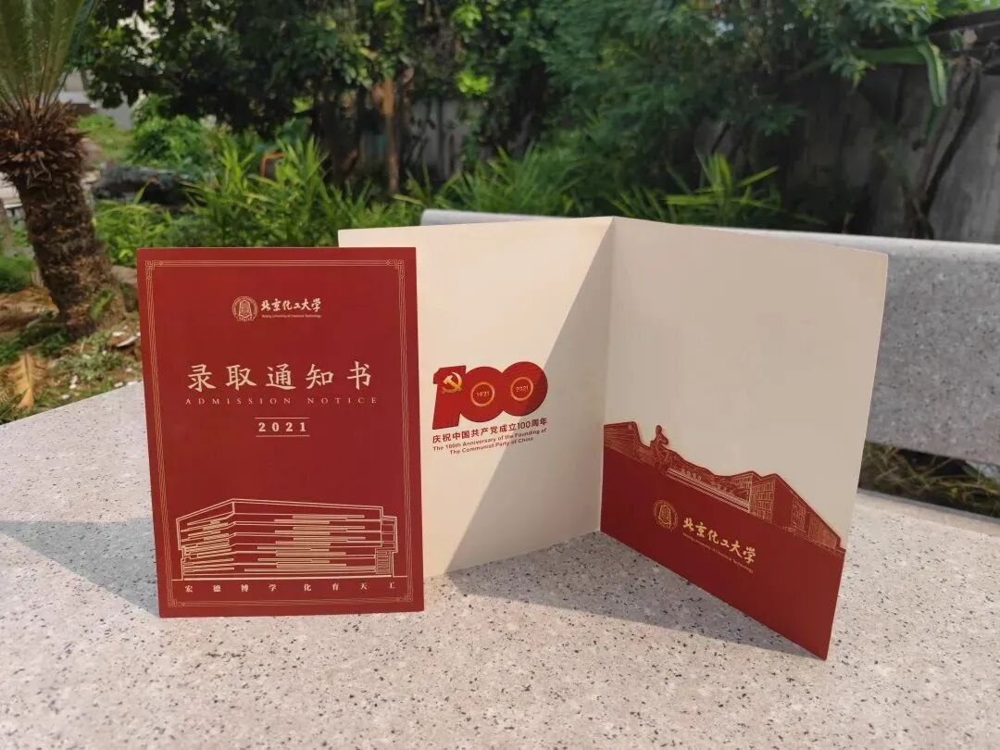
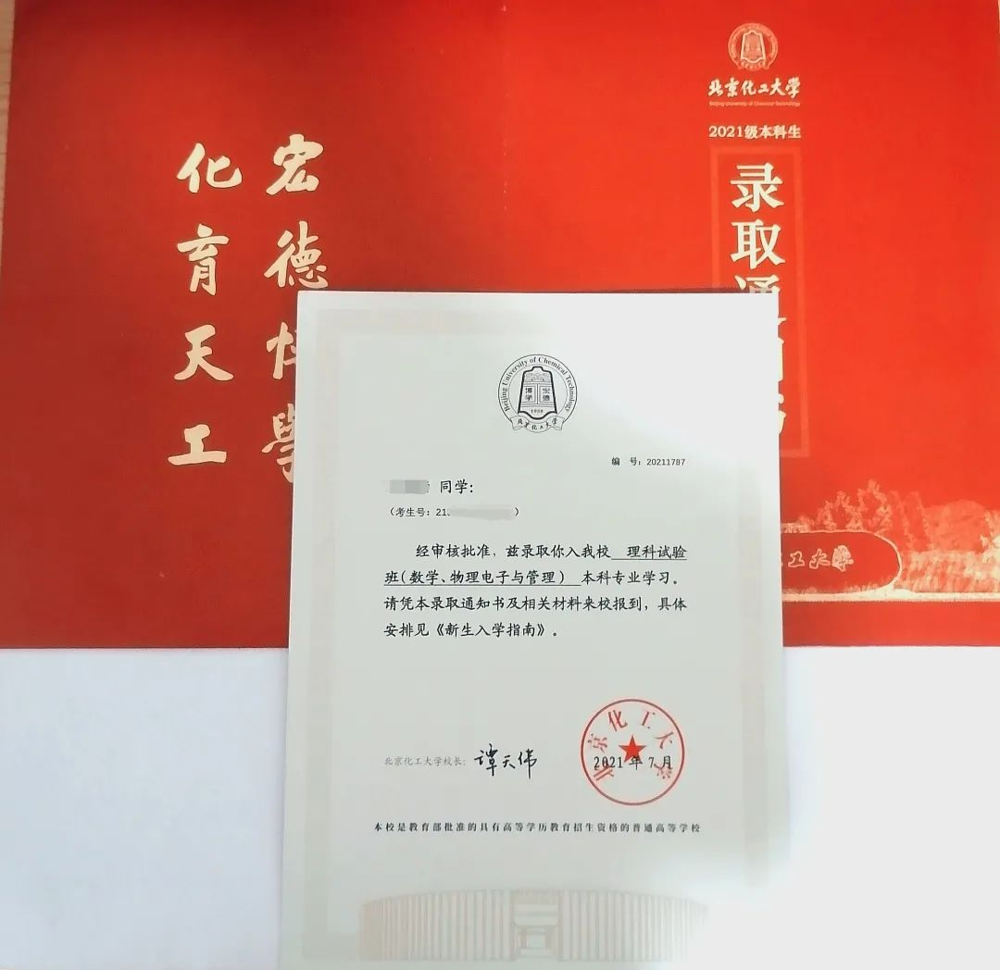

百年风华正茂，青春砥砺前行。

在这个盛夏，跨越万水千山，北京化工大学录取通知书正火速向你飞奔而去。祝贺你圆梦北化，正式加入北京化工大学大家庭！

让我们一起揭秘这份专属于 2021 级北化新生的限定惊喜~

---

## 01 封面与配色设计

2021 版高考录取通知书以**“承百年薪火，育时代新人”**为设计基调，主色调沿用经典的**中国红与绛红**，热烈而庄重。

* **封面元素**：封面采用立体烫金工艺，以北京化工大学校徽为核心，辅以放射状的线条与祥云纹饰，象征着青年学子怀揣梦想、朝气蓬勃的青春力量。
* **建党百年精神**：恰逢中国共产党成立 100 周年，设计中融入了对时代新人的殷切期望，彰显学校“办党和人民满意的教育”之办学初衷。

---

## 02 内页与细节解析

展开通知书，内部结构层次分明，集功用性与纪念意义于一体：

### 1. 校训精神与建筑剪影
* **校训镌刻**：内页上方上方赫然印有北京化工大学校训——**“宏德博学，化育天工”**，寄语 2021 级新生胸怀大志、勤勉求学。
* **标志性建筑**：内页底部勾勒出昌平校区与东校区的代表性建筑剪影，将标志性的校门石、第一教学楼与图书馆融为一体，代表学校对新生的热烈欢迎。

### 2. 纪念卡槽与陪伴寄语
* **录取纪念卡**：通知书内部包含专为新生设计的“录取纪念卡”，可独立拆卸珍藏，记录下进入大学这一人生关键时刻。
* **陪伴寄语**：从这一刻起，你将与北化携手同行，在未来的大学时光里探索前沿、追求卓越，书写属于你的青春篇章！

