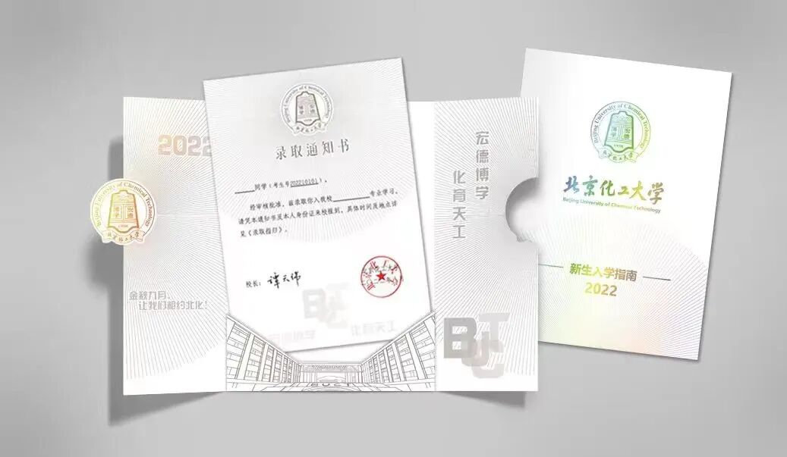
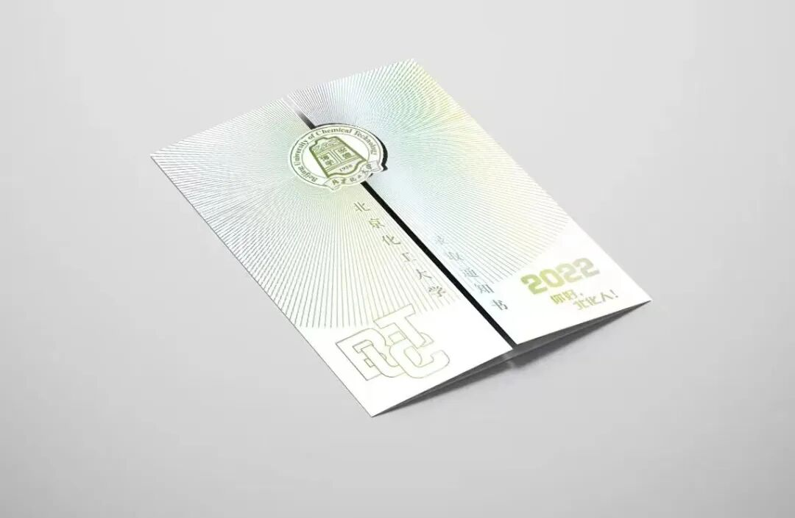
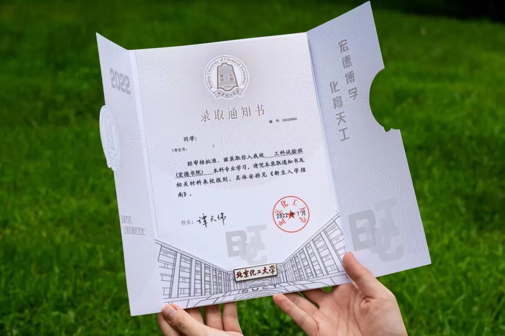
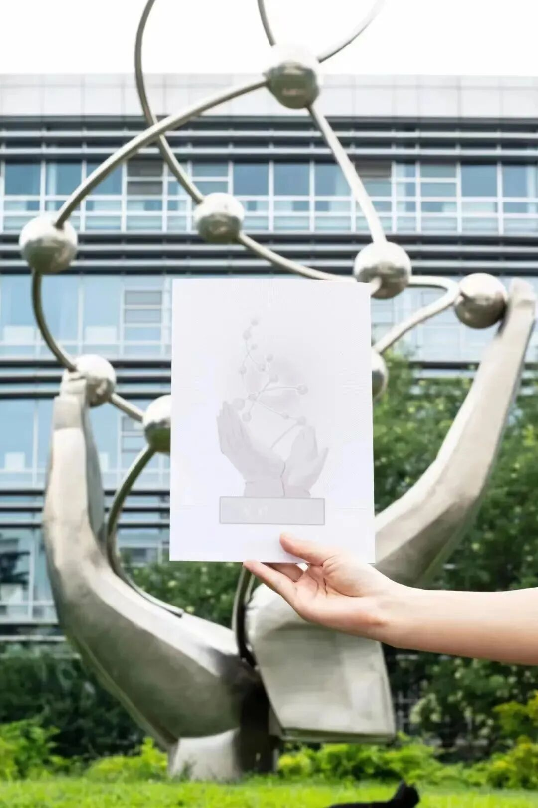

披星戴月走过的路，终将会繁花遍地。高考结束后，新的征途即将启航。在这个夏天乘着满载期望的风，录取通知书跨越万水千山向您派送，祝贺您圆梦北化！

一起来看看这份寓意满满的通知书吧~

---

## 01 封面设计理念：追光笃真

今年的录取通知书主题为**“化育天地，追光笃真”**。

* **白色基底**：以简约的白色为底，代表了北化学子积极进取、乐观豁达的处事风格。
* **光芒纹样**：封面以“光芒四射”的纹样为基，北化校徽位于光芒中央，璀璨生辉，流光溢彩。
* **寓意解析**：谓以每一位北化学子都能成为**追着光、靠近光、成为光、散发光**的人。

---

## 02 内页与背面细节解析

### 1. 内页结构与校训
展开内页，底部第一教学楼的简笔画承托起录取通知书，新生们的大学新生活都会在这栋教学楼里拉开序幕。

* **校训展示**：录取通知书可以取出，底下印有 **“宏德博学，化育天工”** 的校训。
* **星光闪烁**：同封面一样以散发光芒的纹样为底，从各个角度看都如同星星般围绕着校徽闪烁。**“星光不负赶路人”**，漫天星辰般的北化人都在各自的星轨中发光发热，为梦想而奋斗。
* **昌平校区风景**：录取通知书的背面是湖光山色的昌平校区风景画。书本打开，彩烟袅袅，北化为您编织了一个五彩斑斓的梦，我们跨越山海，见证理想。

### 2. 外封背面："母校之光"
外封的背面印有校园内的标志性雕塑**"母校之光"**。

"母校之光"矗立在东校区中心花园，为纪念建校 45 周年而立。在大学四年里，我们启光、追光、承光，为我国化工建设贡献新青年的力量。

