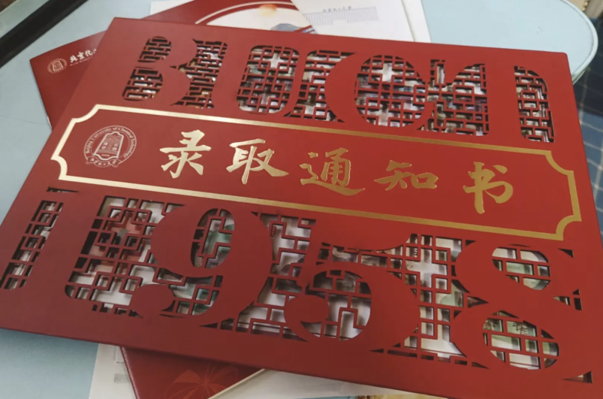
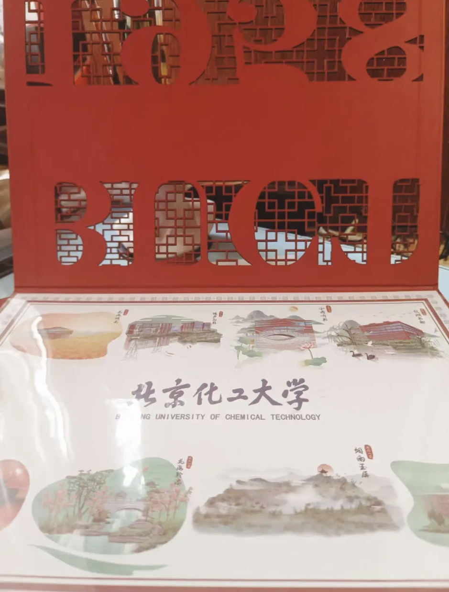
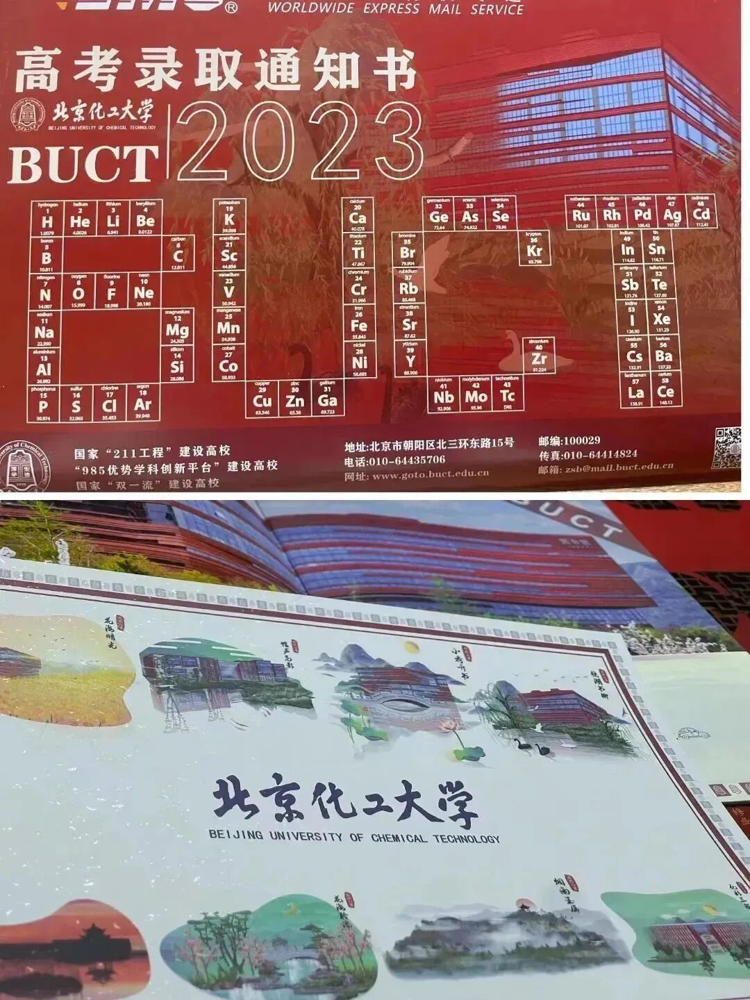

## 01 镂空层叠设计

2023 年录取通知书在结构上采用了精美的**镂空工艺**与**层叠设计**：

* **镂空工艺**：封面通过巧妙的精致镂空雕刻，将层叠的空间感展现得淋漓尽致。
* **层叠设计**：通过多层次的设计，呈现出丰富的视觉效果，象征着新生们在大学生活中逐步成长、不断探索的过程。

---

## 02 “校园八景”与地标文化元素

展开通知书，内页巧妙融入了北化的**“校园八景”与标志性建筑元素**，将校园的风采与深厚的校史底蕴呈现在新生面前：

### 1. 校园八景与“BUCT”样式的元素周期表
* **校园八景**：通知书设计中融入了**“母校之光”雕塑、第一教学楼、校门石、图书馆、昌平校区山水景观**等标志性“校园八景”元素，用细腻的线条勾勒出北化四季风貌与人文景观。
* **校训精神**：内页右侧印有北京化工大学校训——**“宏德博学，化育天工”**，寄语新生胸怀报国志向，笃行求索之路。
* **“BUCT”样式的元素周期表**：在设计中巧妙融入了“BUCT”样式的元素周期表，象征着北化学子在科学探索与创新实践中不断追求卓越。

### 2. 纪念留存与未来期许
* **层层递进**：通过镂空抽拉与翻开，校园景色如画卷般依次呈现，代表着新生的大学生活将从这里正式拉开序幕。

