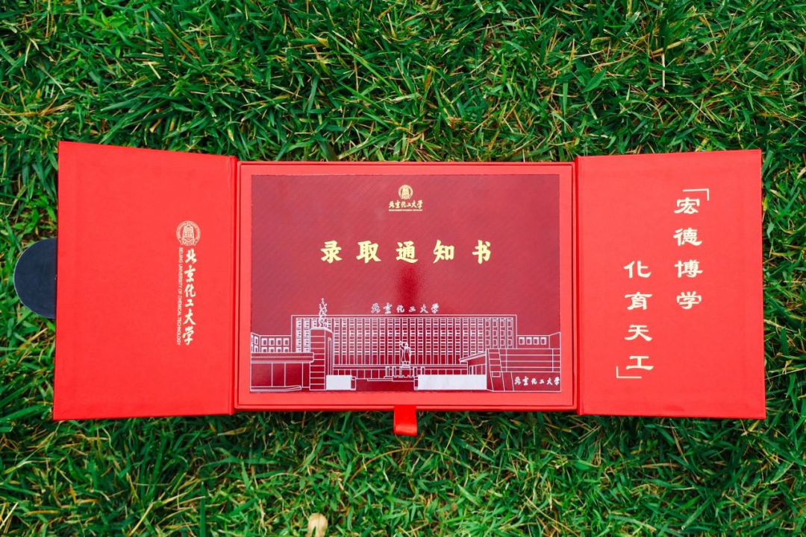
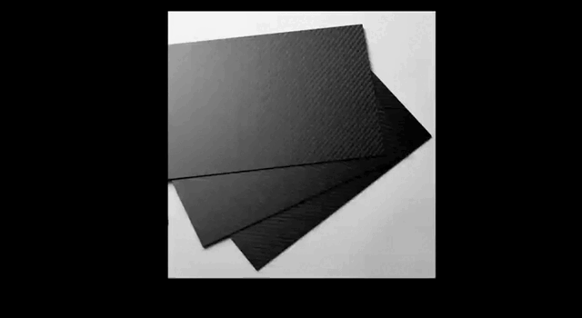
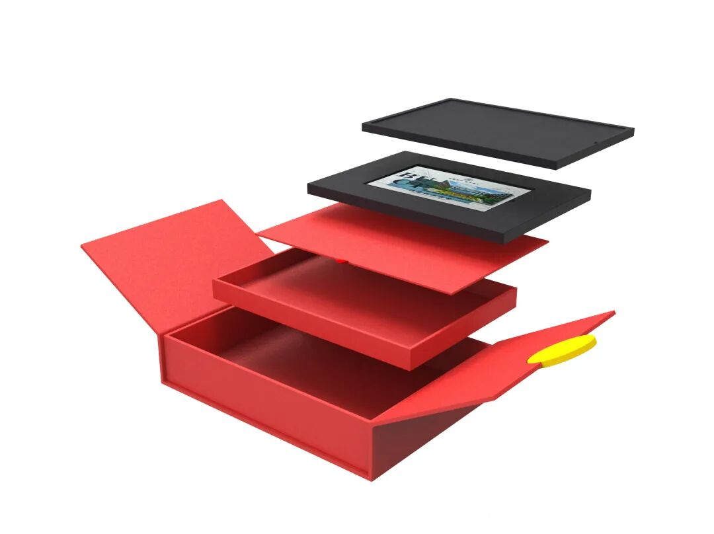
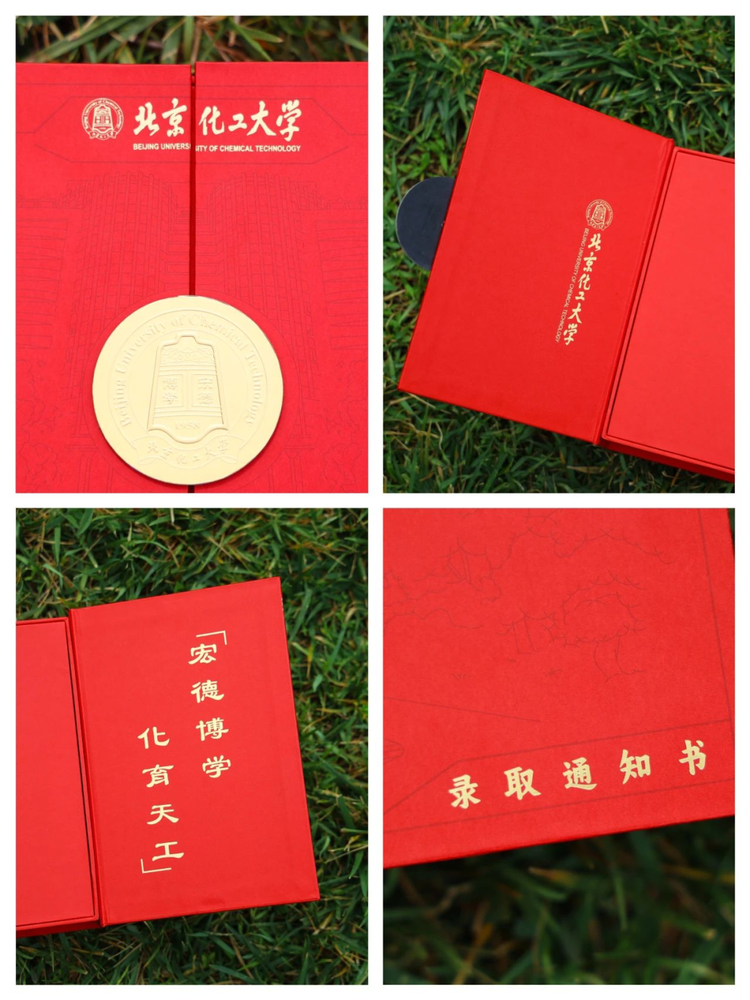

2024 年，北京化工大学高考录取通知书采用**细如发丝，轻如鸿毛，强如钢铁，贵如黄金**的碳纤维复合材料制成。

碳纤维被誉为工业“黑黄金”，具有质量轻、高比强度、高比刚度、耐高温、耐腐蚀等特性，目前已被广泛应用于运载火箭、卫星空间站、大飞机、大型船舶等“大国重器”。

欢迎 2024 年广大考生报考北化，共同“开启”这份与大国重器“同款”的碳纤维录取通知书！

---

## 01 科技与艺术交融：碳纤维“硬核”工艺解析

这封用碳纤维“编织”而成的录取通知书，由北京化工大学材料科学与工程学院先进复合材料研究中心（ACC 团队）自主研发的新型碳纤维复合材料制作，厚度仅有 **0.2mm**，在阳光下变换角度，可呈现颜色变化，极具艺术与科学之美。

### 1. 突破关键技术与批量制作
学校科研团队应用先前突破的国产宇航级碳纤维专用复合材料和高质量热压罐整体成型技术，攻克了多项关键工艺：
* **内应力释放与平整度调控技术**
* **表面 UV 印刷技术与烫金工艺技术**
* **建筑物图案彩色印刷技术**

最终成功实现了“碳纤维录取通知书”的批量制作。

### 2. 从“大国重器”到“百姓化”转型
* **科研底蕴**：2022 年北京冬奥会前，学校科研团队联合相关单位研制出第一台国产碳纤维雪车；北京冬残奥会轮椅冰壶比赛中，中国队使用的碳纤维冰壶推杆也由北化自主研发设计，助力夺得金牌。
* **话剧《化碳为纤》**：学生话剧团曾以研究团队三十多年的研发历程为背景创作话剧《化碳为纤》，展现了北化科技工作者“宁愿青丝变白，也要化碳为纤”的科研精神。

> **杨小平教授（有机无机复合材料国家重点实验室副主任）**：  
> “碳纤维录取通知书不仅展示了学校在碳纤维复合材料领域的卓越实力，也代表了国产碳纤维复合材料从‘高端化’产品向‘百姓化’成功转型，是学校科研成果转化的生动实践。”

---

## 02 礼盒与内包装设计理念

传承与创新并重，艺术与科技交融。2024 版录取通知书礼盒从外包装到内页均体现了独运匠心。

### 1. 外包装礼盒设计
* **红色主色调**：外包装礼盒以热烈的红为主色调，暗喻着北化从火红年代走来，始终赓续着传承的红色基因。
* **烫金工艺**：采用烫金工艺打造校名、校徽及“录取通知书”字样，华丽庄重，象征着学子们在“母校之光”照耀下全面成长成才。

### 2. 内部结构设计
轻启金色的校徽，对开的设计既美观又方便使用：
* **左侧**：烫金印有校名。
* **右侧**：烫金印有校训 **“宏德博学，化育天工”**。

---

## 03 通知书单页与包装内容

### 1. 通知书单页设计
* **正面设计**：以白色和淡黄色为主，清新简洁。正中书写“录取通知书”字样，下半部分展示昌平校区主楼的艺术线稿图。单页四周纹饰取自校徽中的**“铜钟”**元素，寓意校园钟声犹如激越的人生号角。
* **背面设计**：以红色为主色调，辅以黑、金、白三色。朝阳校区教学楼线稿图与正面的昌平校区相呼应，呈现历史与现代的融合。单页采用自主研发的碳纤维材质，保留其独特的纹理，彰显科技美感。

### 2. 随箱包装内容
除了精美的碳纤维录取通知书外，包装内还包含：
* 一套校园风景明信片
* 新生入学指南
* 学生资助服务手册
* 银行卡等入学所需材料

---

立强国报国之志，成栋梁柱石之才。欢迎广大考生报考北京化工大学，为校训“宏德博学，化育天工”写下新的时代注脚！