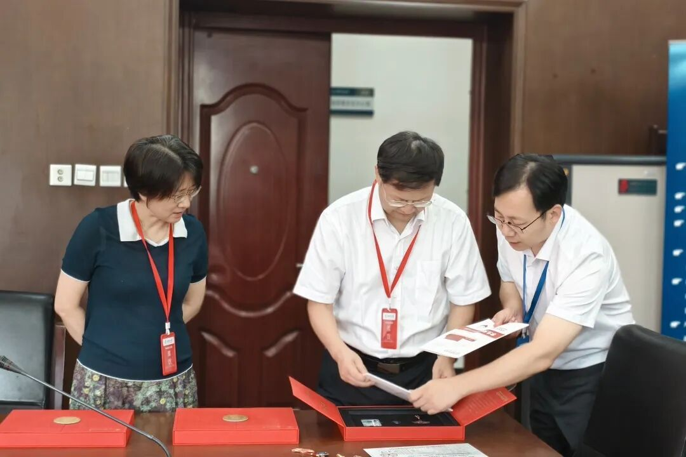
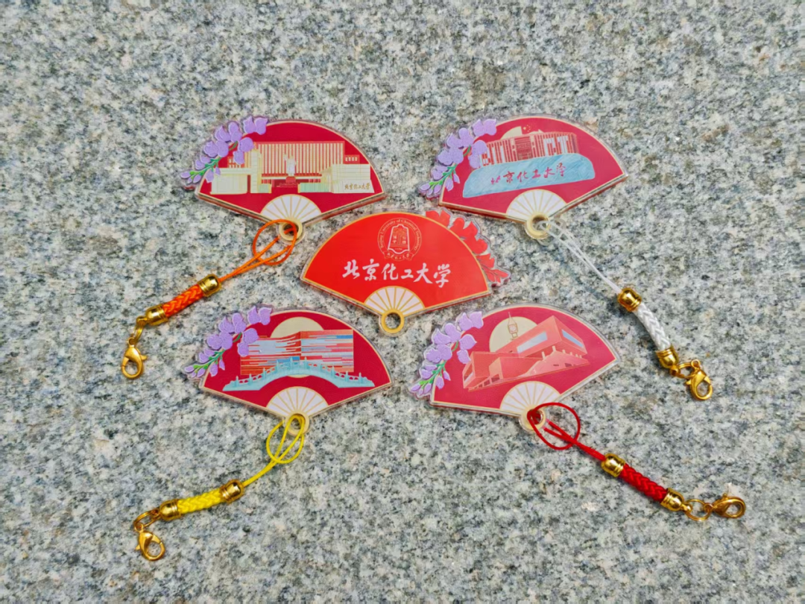
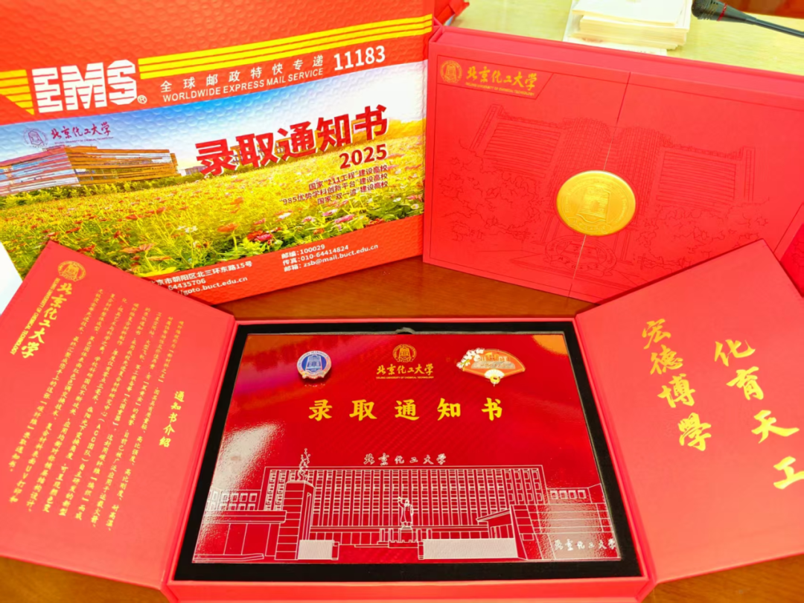
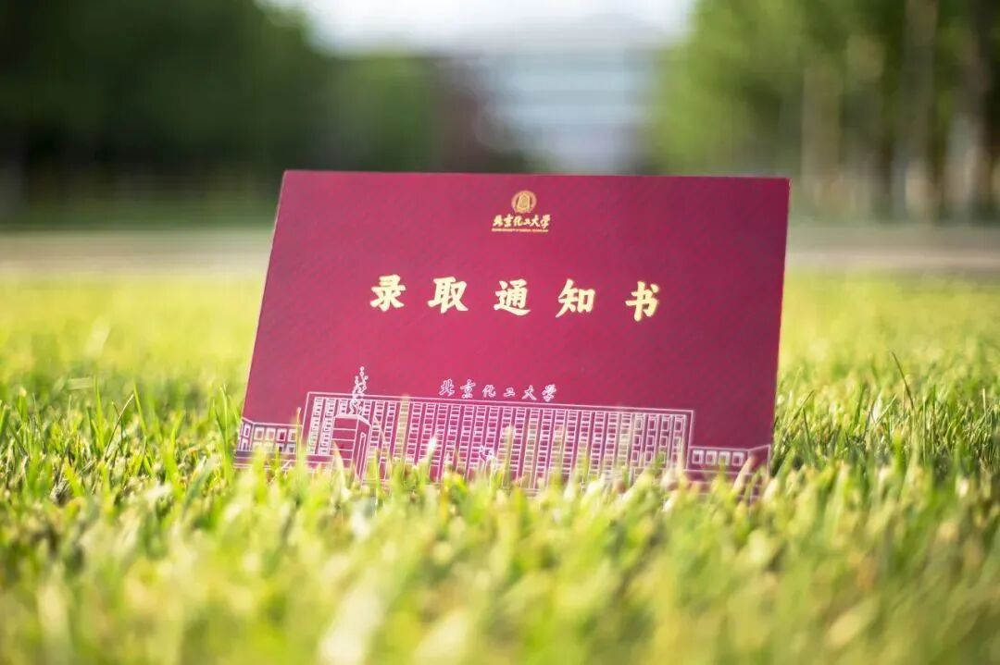
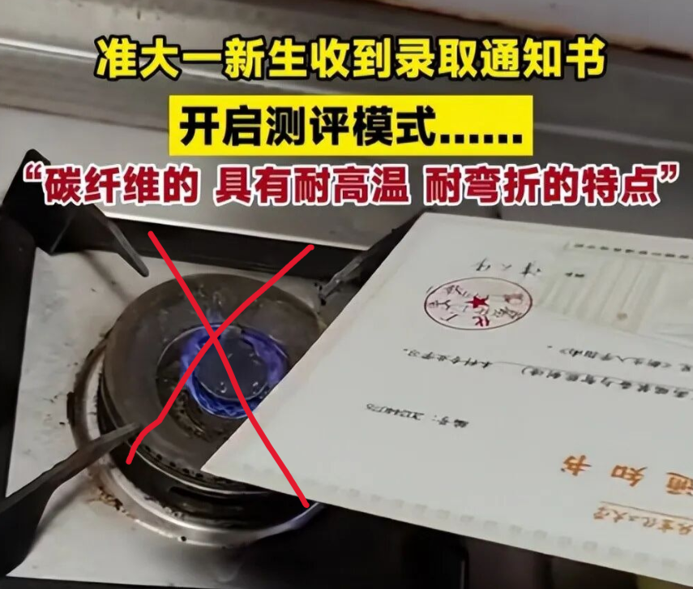

亲爱的准北化人，此刻，一份份特殊的邀请函带着北化的热情与温度，正陆续启程奔向 2025 级的你！

工作人员仔细整理封装，严谨核对每一份信息，小心摆放每一件物品，深藏对这份“见面礼”的用心。7 月 24 日，北京化工大学校长、中国工程院院士谭天伟与副校长苏海佳来到本科招生录取现场，实地指导并慰问了一线工作人员。

---

## 01 设计传承与“光致变色”黑科技

2025 级录取通知书**延续了 2024 年的碳纤维材质与整体设计**，将硬核科技与文化底蕴完美融合。除了经典的碳纤维录取通知书外，包裹里还藏着一枚随机款式的**光致变色钥匙扣**——左上角的紫荆花图案藏着妙趣横生的“光影密码”：

* **变色现象**：在阳光下，原本近乎透明的花瓣会迅速晕染开温柔的紫色，仿佛瞬间绽放；而回到室内避光处，紫色又会悄悄褪去，花瓣重归通透。
* **科学原理**：日光的紫外线使光致变色染料分子发生结构改变，从无色结构转变为有色结构；转移到室内无紫外光照射时，再可逆变回到无色结构。

每一次光影变化，都是对“宏德博学，化育天工”校训的微观诠释。

---

## 02 ⚠️ 温馨提示：保护你的青春限定款

全网都在挑战北化碳纤维录取通知书的坚韧质量，但作为你“金榜题名”的留念才是它的使命！

> **安全第一，谨慎测试：**  
> 这份青春的限定款**仅此一张，损坏不补**！请切勿进行切割、火烧、油炸等危险操作，安全最重要！

---

“化”梦想为征途序章，“工”筑青春以赴远方。各位准 BUCTers，经过十二载奋发图强，你们终于迎来了自己的曙光。待到金桂飘香，我们于北化共同启航！