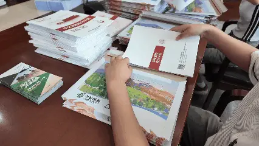
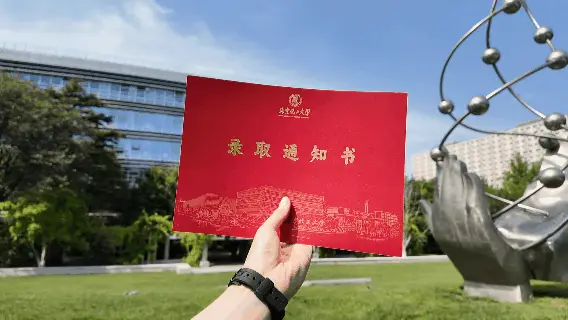
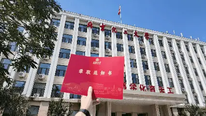
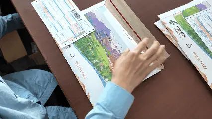

亲爱的 2026 级北化人：

一纸录取信，千里赴新约！2026 级本科录取通知书封装工作已全面启动，一封封承载期许的录取包裹正跨越山海奔赴各位新生。

---

## 01 响应号召：回归“一页纸”的简约之美

今年，教育部明确要求高校录取通知书**回归“一页纸”**。我校积极响应号召，以简约质朴的设计传递育人初心：

* **回归本真**：通知书虽“瘦身”，但北化对每一位新生的诚意与期待不减分毫。
* **绿意育人**：以更绿色、更环保的方式呈现金榜题名的喜悦，彰显高校社会责任感。

---

## 02 严谨细致：多道工序层层把关

为了确保每一份录取包裹准确无误、完好无损地送到大家手中，现场工作人员严把质量关：

1. **规整装填**：从录取通知书的妥善安放，到入学配套资料的规整装填。
2. **双重核验**：对录取专业、收件信息进行双重核验，确保精准寄达。
3. **安全防护**：对信封进行严密的密封与防水防护处理。

工作人员以审慎的态度严防疏漏，以稳妥周全的流程守护每份来之不易的录取喜悦。

---

各位 2026 级新同学，请保持电话畅通，静候录取包裹的到来。我们在北京化工大学期待与你相遇！北京化工大学2024版录取通知书