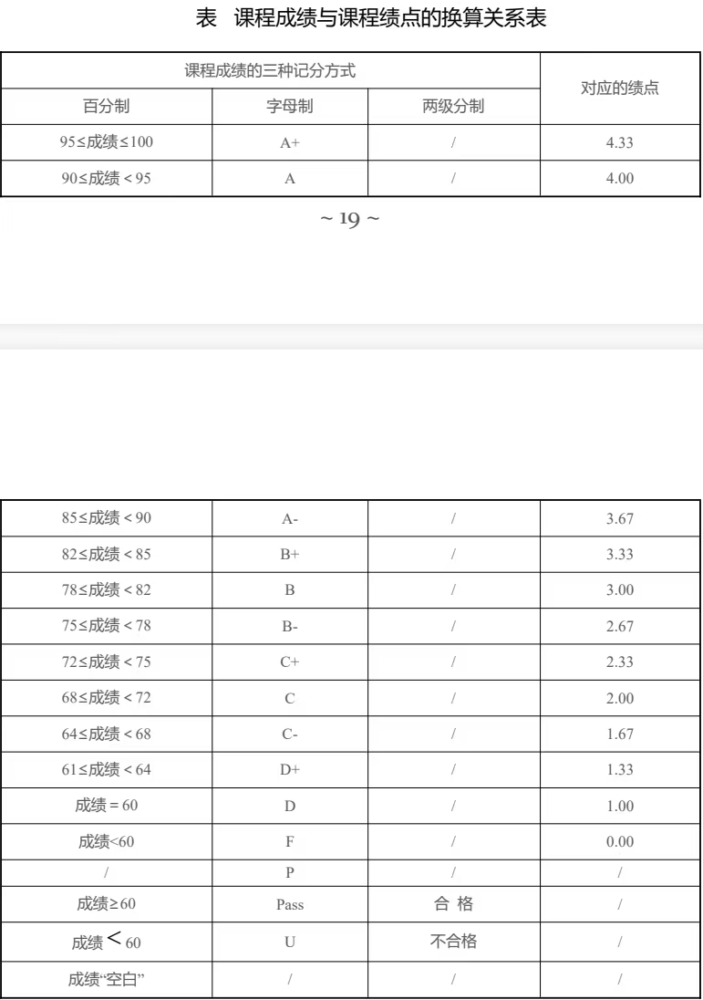

## 课程分类 
- **必修课**
  Ⅰ、必修课即顾名思义必须选择的课程，学校会将课程直接安排在课表中，无需后续进行选课等操作。  
  Ⅱ、必修课一般包括公共基础必修、实践环节必修、专业必修  
- **选修课**  
  Ⅰ、选修课需要根据学分需要在选课阶段进行自主选择相应的课程。  
  Ⅱ、选修课一般包括专业选修、公共基础选修。  
  Ⅲ、具体需要选择的课程可以登录**北京化工大学教务管理系统**➡信息查询➡学生学业信息查询，点击对应选修内容，可以提前确定自己应该选择的课程。  
- **素质教育课**  
  Ⅰ、素质教育课分为素质教育课程与素质教育实践，均需要根据对应属性在选课阶段进行选择，该部分学分内容在大学毕业前完成即可。  
  Ⅱ、登录与选修课相同的路径，查看需要选择的素质课程类型。
  Ⅲ、**注意素质课程有一条规定**：必须选择一门课程性质为**素质核心课程**，注意甄别课程性质，提前规划好课程的选择，防止影响毕业的核心要求。  
  >建议同学们可以尽量选择网课哦，相对时间安排较为轻松！
- **体育课**
  该课程较为特殊，虽属于必修课程，但需要进行选课操作，可以自愿选择三个志愿，后根据抽签进行人员确定，若均没有被选择，则后续可根据相关规定进行补选操作。
- **创新学分**  
  注意该学分的要求，该学分的查询在**企业微信**➡**教务处**➡**创新学分**，在毕业前必须拥有2学分，否则将会影响毕业。该学分可以通过相关讲座的听取、竞赛项目的进行从而获得。  
## 各专业培养方案的查看  
&nbsp;&nbsp;&nbsp;&nbsp;&nbsp;&nbsp;可以登录**北京化工大学教务管理系统**➡**文件**处寻找所在专业的培养方案。  
## 培养阶段   
- **大类培养阶段**  
  分流前：主要以公共基础课程为主。  
- **专业培养阶段**  
  分流后，随着年级的增加，随后以专业课程为主。  
## 学籍异动培养计划  
&nbsp;&nbsp;&nbsp;&nbsp;&nbsp;&nbsp;学籍异动的学生需按照异动后所在年级的专业培养计划进行修读，并需完成异动后所在年级专业培养方案中的毕业学分要求才可以顺利毕业。
## 选课 
- **选课**
  在规定时间内根据自己的需求进行课程选择。
- **停开课程**
  当所选课程素质教育课少于25人，专业选修课少于15人时，课程会停开。  
- **免修**
  Ⅰ、计算机课：在大一上会进行计算机测试，如果通过该测试，则可以免修计算机课程。
  Ⅱ、英语课：四级成绩≥560；托福成绩≥80分或雅思成绩≥6分时，可以在相关时间内申请英语课程免修。  
## 教学评价 
- **评价路径**
  微信搜索“教学质量管理平台”，选择学校，输入账号和密码即可登录。  
- **必要性** 
  教学评价是每一位北化学子的义务，若没有在规定时间内进行评价，后续将会导致下学期课程无法选课等情况。  
## 成绩与绩点
- **绩点换算**
  根据换算规则，学分占比越大，对绩点的影响程度越大。
  
- **成绩与绩点换算规则**
   