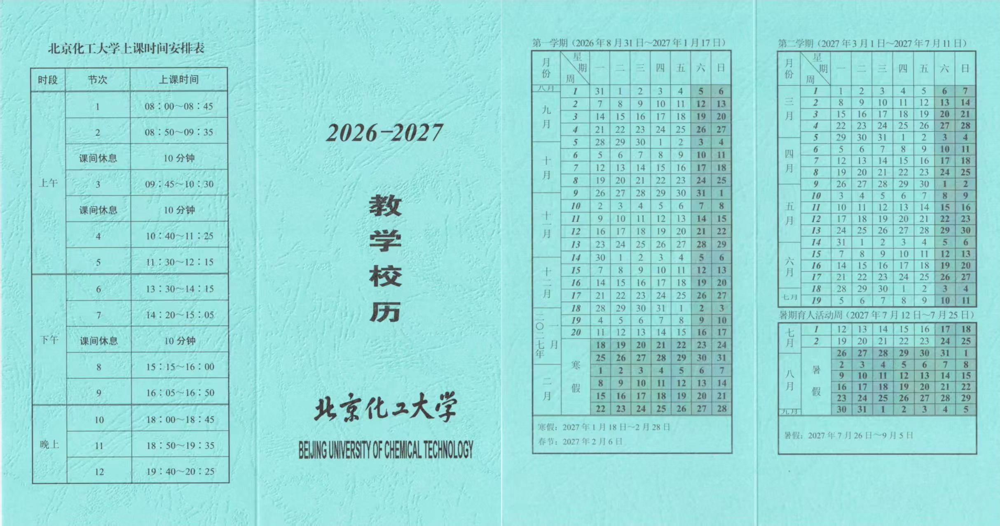

# 校历与学期时间节点

> 本文梳理北京化工大学2026-2027学年校历关键时间，涵盖两学期起止日期、寒暑假安排及每日上课节次，方便师生提前规划教学与生活。

## 一、概述

校历是学校教学活动的时间总纲，明确了每学期的开学、结课、考试及假期时段。本指南依据学校官方发布的校历编制，适用于全体本科生。文中时间节点均为计划日期，如遇特殊情况（如法定节假日调休、疫情防控等），以学校最新通知为准。

> **注意**：本内容仅包含学期框架日期，具体选课、考试、补考等详细安排，请关注教务处或研究生院后续通知。

## 二、校历图片参考

以下为学校发布的2026-2027学年教学校历及上课时间安排总表，可供查阅每周对应日期及每日节次。

> **提示**：图片包含上课节次时间和每学期每周的日历对照，建议下载保存以便随时查看。

## 三、第一学期（2026年8月31日 ~ 2027年1月17日）

### 3.1 开学与教学周
- **开学日期**：2026年8月31日（星期一）正式上课。
- **教学周数**：预计共20周（含考试周）。
- **重要节点**：新生报到、入学教育、军训等时间以各学院通知为准。

### 3.2 考试与结课
- 结课时间：2027年1月10日左右（第19周末）。
- 期末考试周：2027年1月11日 ~ 1月17日（第20周）。

### 3.3 寒假安排
- **起止日期**：2027年1月18日（星期一）至 2月28日（星期日）。
- 假期时长：共6周（42天）。

## 四、第二学期（2027年3月1日 ~ 2027年7月11日）

### 4.1 开学与教学周
- **开学日期**：2027年3月1日（星期一）正式上课。
- **教学周数**：预计共19周（含考试周）。
- 注意：3月1日若逢周末则顺延，请以实际通知为准。

### 4.2 考试与结课
- 结课时间：2027年7月4日左右（第18周末）。
- 期末考试周：2027年7月5日 ~ 7月11日（第19周）。

### 4.3 暑期育人活动周
- **时间**：2027年7月12日（星期一）至 7月25日（星期日）。
- 内容：学校统一安排的社会实践、学术讲座、创新训练等活动，具体方案由学工部发布。

### 4.4 暑假安排
- **起止日期**：2027年7月26日（星期一）至 9月5日（星期日）。
- 假期时长：共6周（42天）。

---

最后更新：2026-08-04

