# 北京化工大学（昌平校区）

樱花苑学生公寓楼位于紫竹食堂南侧，共有7栋楼，7栋楼都是7-9层的小高层配备电梯，分别是樱花苑1、樱花苑2、樱花苑3、樱花苑4、樱花苑5、樱花苑6、樱花苑7

紫竹苑学生公寓位于紫竹食堂北侧，共有4栋楼，4栋楼均为5层楼，分别是紫竹苑1、紫竹苑2、紫竹苑3、紫竹苑4

杏坛苑学生公寓为杏坛苑1、杏坛苑2、杏坛苑3
 
---

### 校园地图
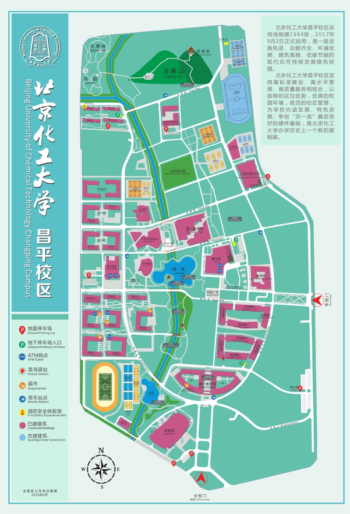

---
### 宿舍楼

## 简而言之

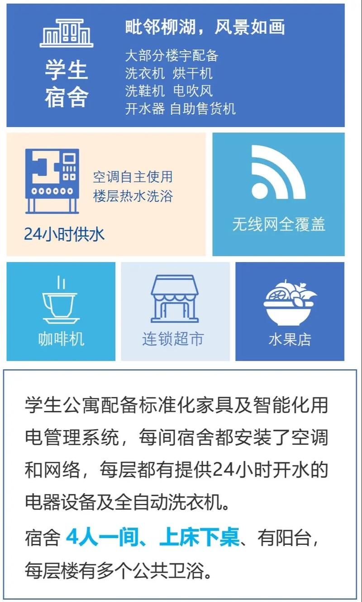
### 宿舍环境

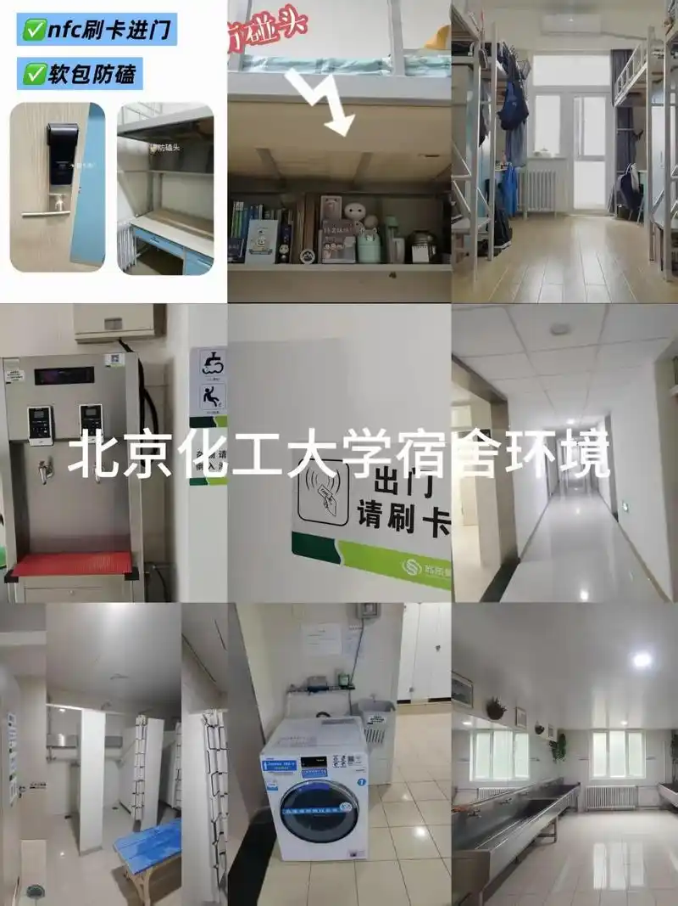

---

## 详情

### 门禁制度
宿舍楼实行人脸识别或本人校园卡识别进出，宿舍门在每日23：00-6：00期间锁门

宿舍楼实行全天候值班及会客登记制度（一般情况男生不允许进入女生宿舍，女生不允许进入男生宿舍，进入需登记（去超市除外））

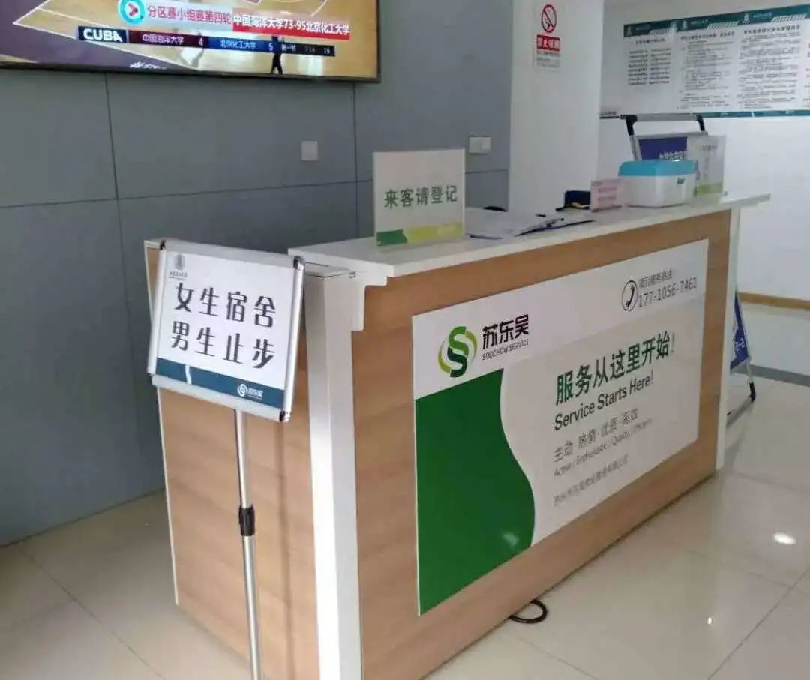

---

### 宿舍
宿舍为四人寝，上床下桌，标配空调、暖气、独立阳台和超大衣柜
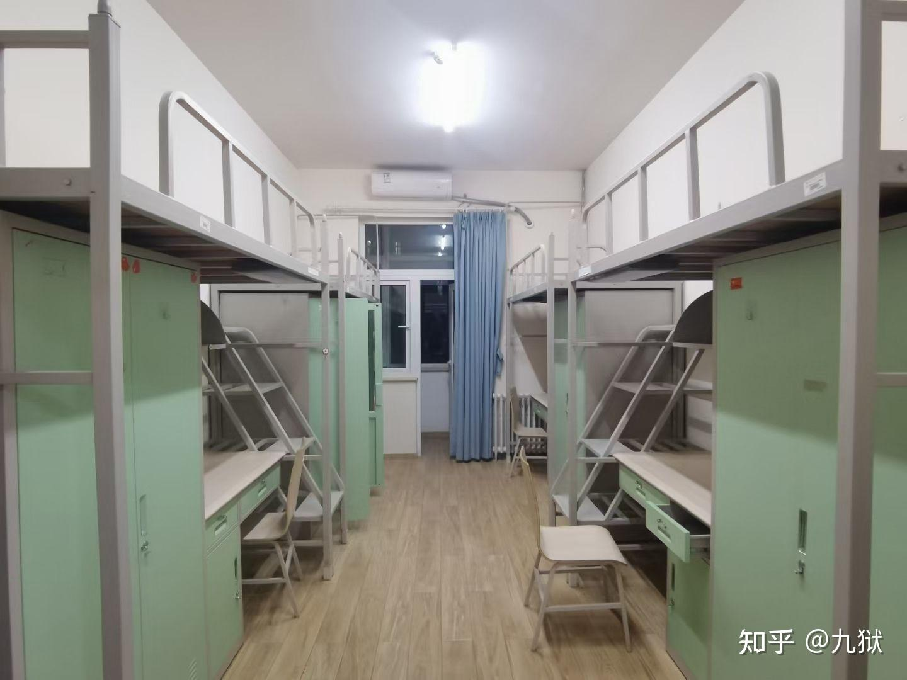
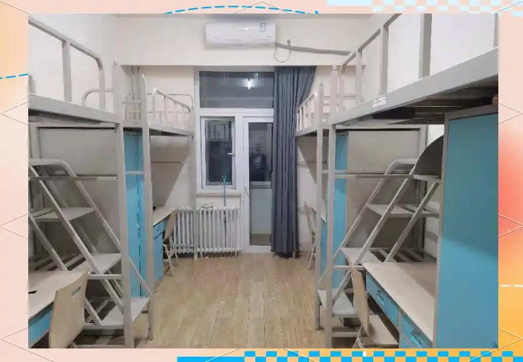

### 宿舍门

宿舍门是电子防盗门，可以通过刷校园卡进入，或者绑定手机NFC即可进入
温馨提示：（如果忘记带校园卡或者手机可以找楼下值班阿姨登记后，阿姨会帮你开门）

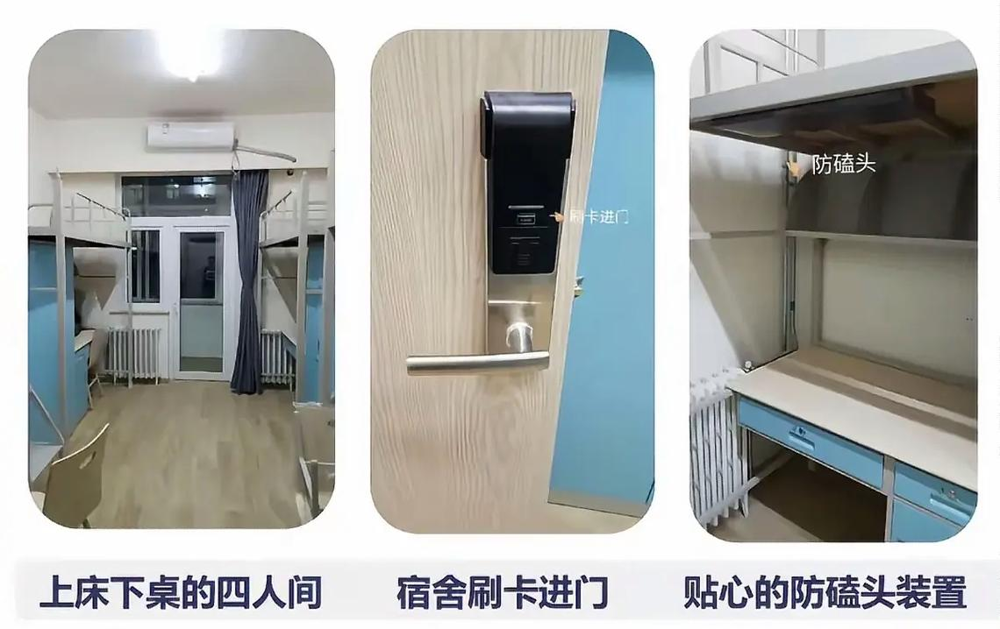

---

### 电梯
电梯非常宽敞，可以容纳12个人左右

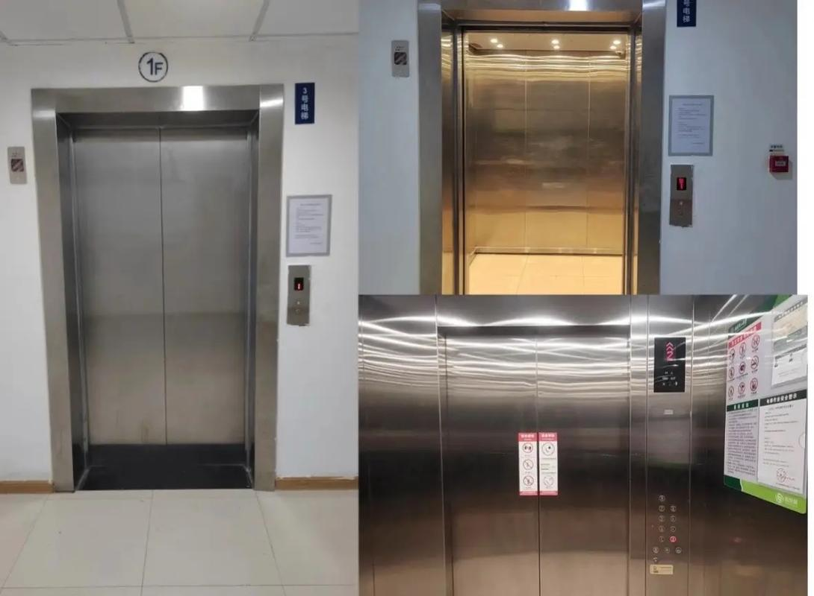

### 功能间
每楼层设有公共卫生间、盥洗室、淋浴间、洗衣机、烘干机、洗鞋机等功能间

每层配有洗衣机、洗鞋机、烘干机均为计时付费，扫码使用微信小程序或者下载智慧笑联使用，根据需求自行选用

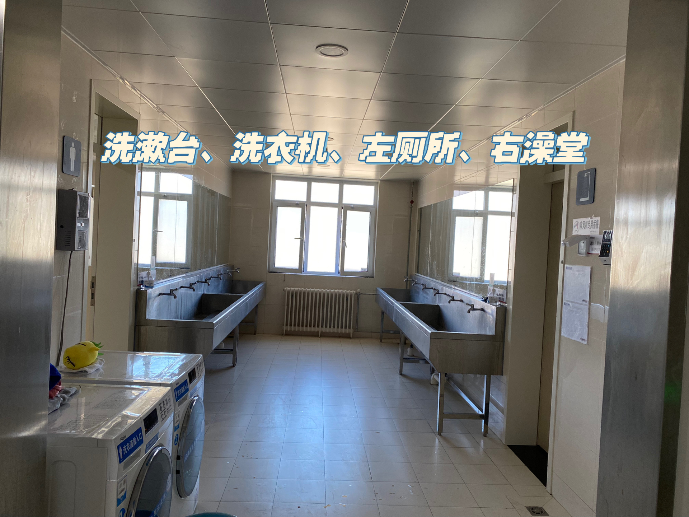

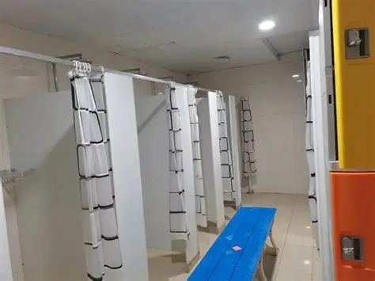

走廊非常宽阔，在走廊尽头设有开水间，可随时接开水

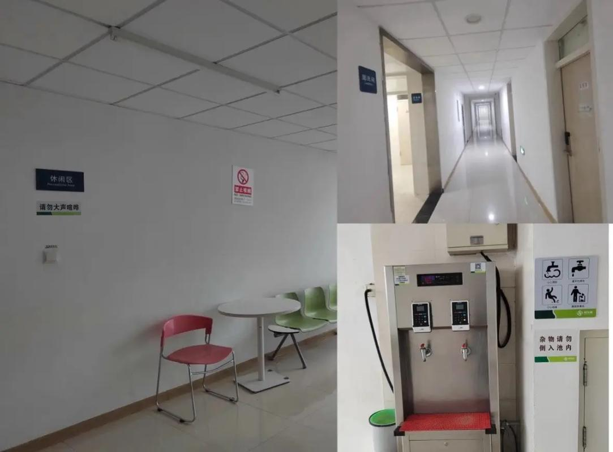

### 其他生活设施

宿舍楼下设有自助售卖机以及咖啡机等

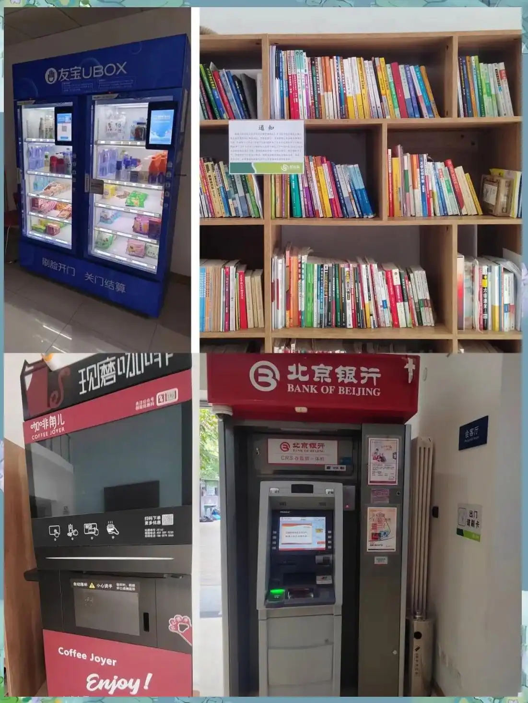

### 会客厅

宿舍楼一层配备会客厅，不允许进入宿舍房间内会客，不得私自留宿来访人员

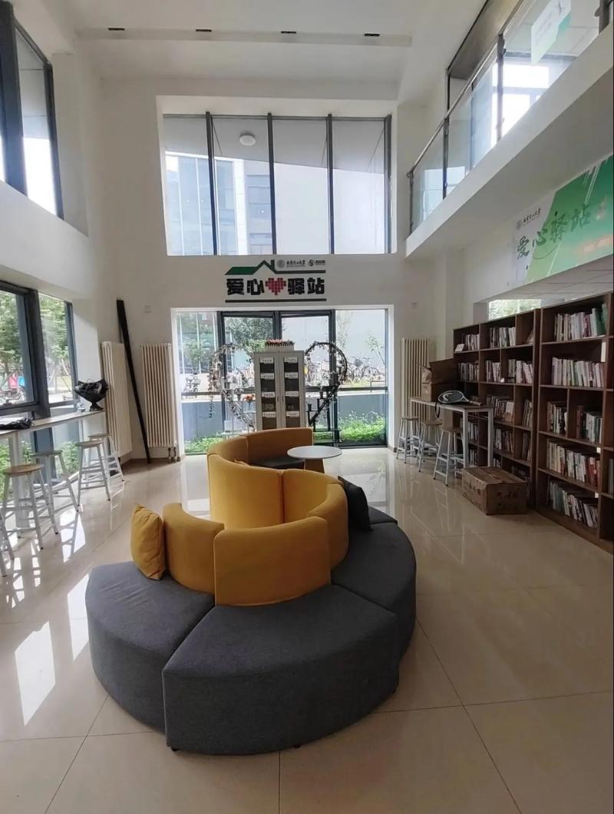

### 休息区

宿舍楼每层配备休息区，休息区不得大声喧哗

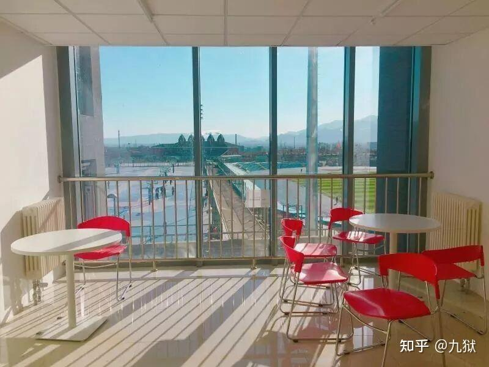

### 自习室

宿舍楼每层配备自习室

温馨提示：自习室是学习的地方，在自习室请保持安静，不要在自习室占座，阿姨每天会定时清理自习室
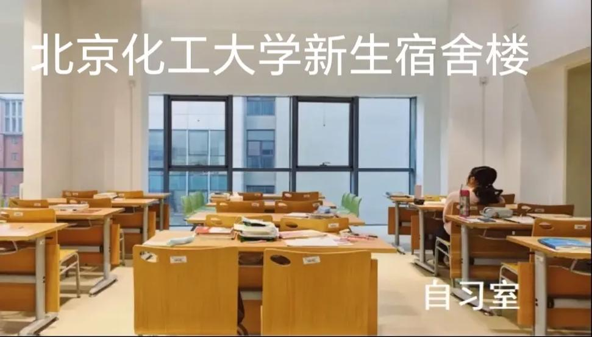

### 自助打印机

宿舍楼下有自助打印机，可以自己扫码打印资料，非常方便，而且很便宜

### 水果店

后勤水果店：8:00-19:00；地址：紫竹餐厅2层西侧
教学楼水果店：7:00-23:00；地址：第一教学楼B座一层西侧
四号楼水果店：8:00-22:30；地址：樱花苑4号楼南侧

### 超市
宿舍楼下有超市，购物非常方便
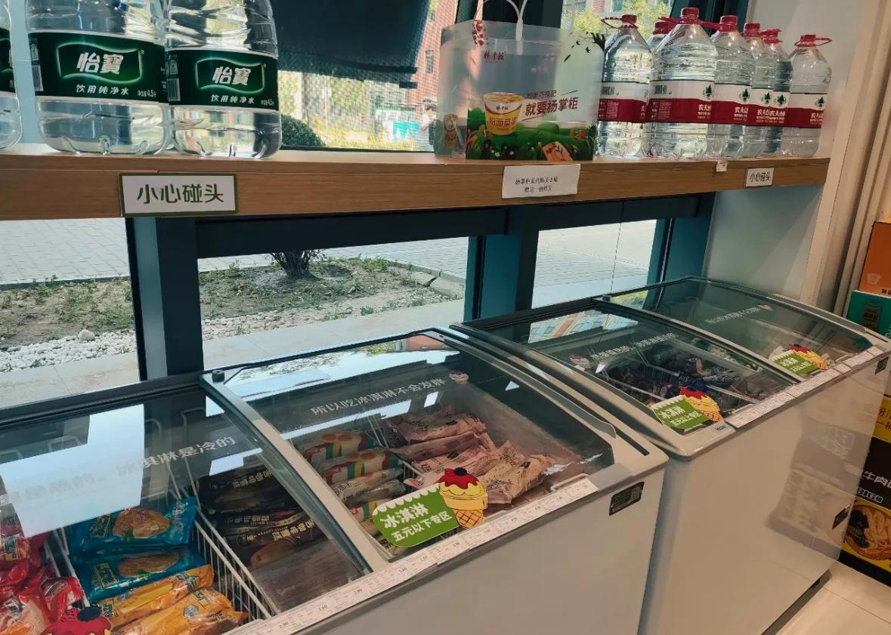

一号楼超市：7:00-22:30；地址：樱花苑1号楼北侧
二号楼超市：7:00-22:30；地址：樱花苑2号楼北侧
七号楼超市：7:00-22:30；地址：樱花苑7号楼北侧
十一号楼超市：7:00-22:30；地址：紫竹苑1号楼北侧
教学楼超市：7:00-23:00；地址：第一教学楼B座一层西侧

---

## 其他

### 宿舍供电与熄灯制度

学生公寓宿舍实行用电、用水配额管理，超出配额指标的水电费由学生自己承担。学校提倡节约水电，杜绝长流水、长明灯现象。发现水电设施损坏，请及时报修，不要擅自修理或拆卸。 

#### 电费充值
通过企业微信校园卡服务可进行电费充值，选择对应的宿舍即可充值

#### 供电时间
 研究生宿舍全天供电；本科生寝室周日至周四 23:00 至 6:00 点断电，每周五、周六 24:00 至 6:00 点断电。节假日及特殊情况以通知为准。

#### 熄灯范围
断室内插座电源、室内照明灯熄灭
熄灯后，寝室空调可正常使用、走廊照明灯可正常使用

### 宿舍违规电器
宿舍禁止使用大功率电器

#### 寝室用电安全
不要使用超过800功率的大型电器，容易发生跳闸

#### 违禁电器
- 烹饪加热类‌：电煮锅、电饭煲、电磁炉、电火锅、微波炉、电烤箱、豆浆机、热得快、烧水器 。
- ‌取暖保暖类‌：电暖器、小太阳、电热毯、电热褥、暖手宝（充电式）、烘鞋器、取暖炉 。
- ‌美容美发类‌：大功率吹风机（通常>800W-1000W）、直发夹板、卷发棒、电熨斗、挂烫机 。
- ‌大型家电类‌：冰箱、冰柜、洗衣机、甩干机（未经批准私自安装）。
- ‌劣质/改装类‌：无 3C 认证插排/充电器、私自改装电器、破损老化线路设备、电动车电池及室内充电器 。
- ‌明火器具‌：酒精炉、煤气灶、卡式炉等含明火加热装置 

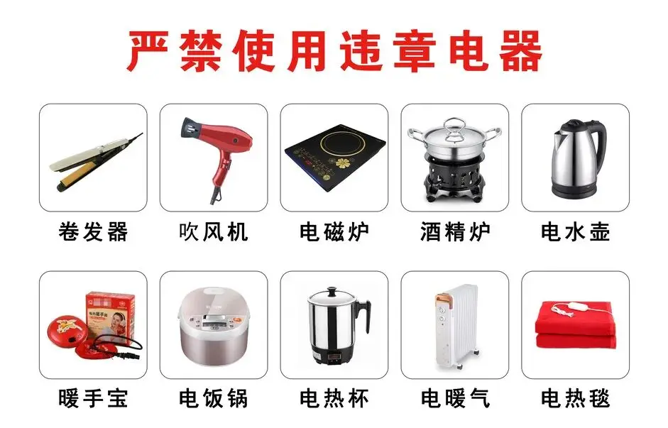
严禁随意使用明火或者乱接电源线，以防引发火灾危及生命安全

### 公共电器
可在卫生间的公用插座插大功率电器，可以使用吹风机、卷发棒等电器
部分宿舍楼下提供免费微波炉，可以用于加热食物，注意微波炉使用注意事项

---

### 学生宿舍管理规定
其他详情见附件北京化工大学学生宿舍管理规定
[北京化工大学学生宿舍管理规定](https://xxgk.buct.edu.cn/_upload/article/files/f2/28/45d0f6c24d2ebe346c605c72f095/f388550d-2206-427f-a8ce-adc49e4bafe5.pdf)

---
