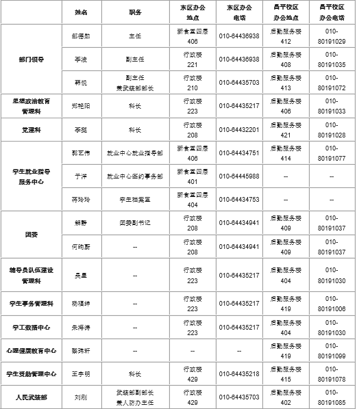
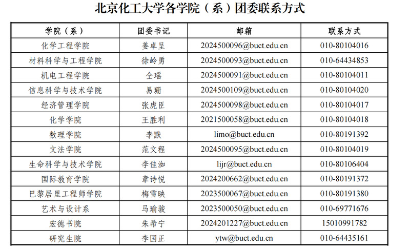

本文汇总学校各部门（党群机构、行政机构、直属单位、后勤保障等）在学生日常事务中的职能与常用联系方式，便于遇到问题时能快速找到对应部门或人员。更详细的机构介绍请参见北京化工大学官网——学校概况·组织机构。

> 温馨提示：遇到问题可优先联系辅导员或班委；宿舍相关问题可联系所在宿舍楼宿管。

## 目录

- [党群机构](#党群机构)
      - [学生工作办公室](#学生工作办公室)
      - [研究生工作部](#研究生工作部)
      - [保卫处](#保卫处)
      - [团委](#团委)
- [行政机构](#行政机构)
      - [财务处](#财务处)
      - [教务处](#教务处)
      - [科学技术发展研究院](#科学技术发展研究院)
      - [国有资产与实验室安全管理处](#国有资产与实验室安全管理处)
      - [国际交流与合作处](#国际交流与合作处)
- [直属单位](#直属单位)
      - [图书馆](#图书馆)
      - [后勤服务集团](#后勤服务集团)
- [附录](#附录)

---

# 党群机构

- 学生工作办公室 — 思政教育、辅导员管理、学生资助与心理健康
- 研究生工作部 — 研究生招生培养与学位管理
- 保卫处 — 校园安全与应急处置
- 团委 — 共青团事务与学生社团管理

## 学生工作办公室

学生工作办公室下设12个办事机构
### 思想政治教育管理科
- 职能：负责本科生学生日常思想政治教育工作；开展“院周”、“新生引航工程”、毕业生“爱校荣校”教育活动；开展学生安全教育、民族团结教育等活动，负责少数民族学生管理服务工作；负责“北化力量”微信公众平台的建设和运营。负责学生工作办公室综合事务的协调、组织和落实；承担学工系统思想政治教育课题科研立项、管理等工作；开展大学生思想政治状况与成长发展状况综合调研。
- 办公地点：行政楼223（东区）、后勤服务楼406（北区）
- 办公电话：010-64435217（东区）、010-80191033（北区）

### 学生党建科
- 职能：负责本科生学生党建工作；开展入党积极分子、预备党员、新生党员、毕业生党员、党支部书记、学生党员骨干等六类学生党员培养；开展红色“1+1+N”结对共建活动，强化学生基层党组织建设；
- 办公地点：行政楼208（东区）、后勤服务楼402（北区）
- 办公电话：010-64432201（东区）、010-80191028（北区）

### 辅导员队伍建设科
- 职能：负责辅导员队伍选拔、管理、培训、考核和奖励；制定辅导员队伍建设规划，开展辅导员专业核心能力建设；负责学风建设和学业发展辅导中心管理；负责学生违纪行为处理；负责《形势与政策》课管理；负责北京高校辅导员培训研修基地（北京化工大学）建设。
- 办公地点：行政楼223（东区）、后勤服务楼404（北区）
- 办公电话：010-64435217（东区）、010-80191030（北区）

### 学生档案管理室
- 职能：负责学生档案的接收、管理和毕业生档案转递工作；负责有关部门对于在校学生形成的党团、奖惩、资助材料等即时归档；负责学生退学、转学、出国、公证手续办理；负责接待应届毕业生工作单位政审，及往届毕业生档案转递信息查询。
- 办公地点：就业404（东区）
- 办公电话：010-64434753

### 校团委
- 职能：负责学校各级共青团组织建设工作；负责全校团干部和学生骨干的选拔、教育和培养等工作；负责指导学校各级学生组织、学生社团的日常工作，指导其开展活动并管理其活动场地；负责学校课外科技活动、志愿服务活动、学生社会实践活动的指导和管理工作；负责大学生素质培养和大学校园文化建设；负责青年学生合法权益的保护工作。
- 办公地点：行政楼208（东区）、后勤服务楼409（北区）
- 办公电话：010-64434941（东区）、010-80191037（北区）

### 学生就业指导服务中心
- 职能：就业创业指导、招聘活动组织、毕业生签约与派遣、毕业生就业困难帮扶等。
- 办公地点：新食堂四层（东区）、后勤服务楼414（北区）
- 办公电话：010-64434751（东区）、010-80191077（北区）

### 学生资助办公室
- 职能：奖学金评定、勤工助学岗位管理、助学金与助学贷款、困难生认定与临时补助等。
- 办公地点：行政楼209（东区）、后勤服务楼415（北区）
- 办公电话：010-64435218（东区）、010-80191079（北区）

### 人民武装部
- 职能：军事课教学、组织大学生参军、国防教育与人防工程管理。
- 办公地点：行政楼210（东区）、后勤服务楼419（北区）
- 办公电话：010-64435703（东区）、010-80191085（北区）

### 学生网络中心
- 职能：网络思想政治教育平台建设、学生工作信息化与网络安全相关工作。
- 办公地点：行政楼408（东区）、后勤服务楼319（北区）
- 办公电话：010-64434334（东区）、010-80191019（北区）

### 学生事务管理科
- 职能：学生突发事件处置、学生意见征集、纪律处分及特殊事务管理。
- 办公地点：后勤楼419（北区）
- 办公电话：010-80191006（北区）

### 学工数据中心
- 职能：负责学生数据中心平台的建设和维护工作；负责学生工作信息化建设与研究；负责开展思想政治工作队伍信息素养提升工作，参与学校创新人才培养和信息化建设相关工作；负责学生大数据挖掘和信息提取工作。
- 办公地点：后勤服务楼404（北区）
- 办公电话：010-80191030（北区）

### 心理健康教育与咨询中心
- 职能：心理健康教育、咨询与危机干预、心理文化活动组织。
- 办公地点：后勤楼417（北区）
- 办公电话：010-80191099（北区）

## 研究生工作部

- **招生办**：招生计划与宣传、考务与复试录取。
      - 办公地址：行政楼306；电话：64433759
- **培养办**：研究生教学管理、成绩管理、课程与考试安排、学籍与培养方案、实践与督导。
      - 办公地址：行政楼320；电话：64451373
- **学位办**：学位论文与授予管理、学位证书制作、导师与学位资格审查。
      - 办公地址：行政楼323；电话：64449549
- **学科办**：学位授权点管理与评估、学位授权审核。
      - 办公地址：行政楼323；电话：64434857
- **综合办**：日常事务、对外联络、资产与财务管理、信息维护。
      - 办公地址：行政楼323；电话：64418141

- **党委研究生工作部**：职能：党建思政、奖助资助管理、就业指导与心理教育等。
       -办公地址：行政楼326；电话：64435161

## 保卫处

**报警电话**：

- 朝阳校区：64452110
- 昌平校区：80191108
- 海淀校区：88587120

紧急事项指南：
1. 财物丢失、人身冲突、治安纠纷、校外人员滋扰 → 拨打校区安保报警电话
2. 楼道/实验室消防隐患、冒烟起火、消防设施损坏 → 校区安保
3. 校园交通事故、大型活动安全问题 → 校区安保

> 注：重大矛盾或安全稳定类事件同时联系学院辅导员。

## 团委

| 学生业务场景 | 对应部门 |
| --- | --- |
| 团员组织关系转接、推优入党、青马工程、团内评奖评优 | 组织部 |
| 大学生活动中心场地预约、团委勤工助学岗位 | 办公室 |
| 社会实践活动、劳动实践课程学分认定 | 实践部 |
| 志愿者报名、志愿时长录入、西部计划项目 | 志愿服务指导中心 |
| 萌芽杯、挑战杯、大创等各类科创竞赛组织申报 | 青年创新创业发展中心 |
| 社团注册、社团年审评比、社团日常问题对接 | 社团指导部 |
| 毕业晚会、辩论赛、话剧展演等文体美育活动 | 文体部 |

---

# 行政机构

行政机构（主要负责学校日常行政、教学管理、财务与人事等）：

- 财务处 — 经费管理、预算与收入管理
- 教务处 — 本科与教学事务管理、教务教学质量保障
- 科学技术发展研究院 — 科研项目与成果转化管理
- 国有资产与实验室安全管理处 — 设备与实验室安全管理
- 国际交流与合作处 — 国际合作、海外学习与交流项目

## 财务处

财务处下设 8 个科室，负责学校经费管理、预算、收入、财务稽核与信息化支持。常见业务场景与对应科室：

| 业务场景 | 对应科室 |
| --- | --- |
| 日常报销、对公到款、外币业务、财务档案 | 会计核算科 |
| 部门预算、经费立项下拨、非科研项目结题 | 预算管理科 |
| 各类专项经费与基建财务决算 | 专项经费管理科 |
| 纵向横向科研经费、科研结题、科研票据 | 科研经费管理科 |
| 学费住宿费、奖助金发放、税务、票据申领 | 收入管理科 |
| 后勤经费、餐饮账务管理 | 后勤经费管理科 |
| 财务系统平台故障、信息化问题 | 信息科 |
| 财务稽核监督与综合管理 | 稽核及综合管理科 |

### 会计核算科
- 办公地点：办公楼115、办公楼102
- 主要职责：日常报销、公费医疗、一卡通结算、发票及档案管理等
- 联系人（示例）：孙倩倩 / 64434875

### 预算管理科
- 办公地点：办公楼112；电话：64433876
- 职能：预算审批、下拨与执行、项目入账与立项、结题管理等

### 专项经费管理科
- 办公地点：办公楼112；电话：64434877
- 职能：专项经费日常管理、合同签订、预算审核与结题等

### 科研经费管理科
- 办公地点：办公楼316；电话：64415942
- 职能：科研经费预算、结算、审计与账务管理等

### 收入管理科

收入管理科负责学校各类非科研性收入的收取、记账、结算与票据管理，包括学费、住宿费、测试费、培训费、工资与奖助金发放等。下表列出常见岗位、办事事项与所需材料（供参考）：

| 科室 | 岗位 | 人员 | 办事事项 | 联系电话 | 申请人所需材料 |
| --- | --- | --- | --- | ---: | --- |
| 收入管理科 | 收入管理岗 | 施小燕 | 学费、住宿费收取与退费审核；学生退学/海外学习欠费审核 | 64415481 | 学费/住宿费收据、离校通知、学生证/学号、相关缴费凭证 |
| 收入管理科 | 收入管理岗 | 施小燕 | 收入审核与入账（开具收入通知单、收入台账维护） | 64415481 | 收入入账资料、银行回单或支付截图、合同/协议（如适用） |
| 收入管理科 | 收入管理岗 | 施小燕 | 收费平台维护与线上支付问题处理 | 64415481 | 支付失败截图、订单号、学生信息 |
| 收入管理科 | 收入管理岗 | 施小燕 | 测试费、培训费及其他临时性收入的结算 | 64415481 | 测试费结算申请单、名单、费用明细 |
| 收入管理科 | 工资、奖助学金管理岗 | 卢勇 | 工资发放、代发申请、批量助学金/奖学金发放 | 64415481 | 工资/发放通知单、人员名单、银行账号信息 |
| 收入管理科 | 票据管理岗 | 李颖异、李哲人 | 发票管理、税务咨询、预借发票与票据领用 | 64415481 | 票据申请单、合同或收据复印件（视具体业务而定） |

### 信息科 / 后勤经费管理科 / 稽核及综合管理科
- 信息科（办公楼317，电话：64413882）：负责财务信息化建设与平台技术支持。
- 后勤经费管理科（办公楼112，电话：64433876）：负责后勤及餐饮账务管理。
- 稽核及综合管理科（办公楼111，电话：64455341）：负责资金监管与财务稽核工作。

## 教务处

1. 转专业、四六级考试、昌平校区学籍成绩单 → 昌平校区教务综合管理科
2. 课表、重修、毕业审核、学籍证明、推免、学业预警 → 教务科（朝阳）
3. 大创竞赛、毕设、实习、实验基地、导师相关 → 实践创新科
4. 教材、课程建设、教改项目、专业培养方案 → 教学科
5. 课堂教学督导、教学质量反馈、教学评估相关 → 督导办公室
6. 多媒体教室故障、录播、教学机房、考试听力设备 → 电教中心

教务处为学校本科教学管理的主管部门，负责教学管理制度建设、人才培养方案、教学运行监控、教学质量保障、学籍管理与成绩审核等工作。教务处既承接教学行政职能，也承担教学改革、课程建设和实践教学组织的职责。主要职能包括：

- 制定与实施本科人才培养规划与教学管理制度；
- 组织课程建设、教材管理、教学改革与教学成果评审；
- 统筹课表编排、教室资源调度与考试组织；
- 管理学籍注册、成绩归档、毕业审核与学位推荐相关事宜；
- 指导实践教学、实习基地建设与创新创业实践项目；
- 负责教学督导、课堂教学质量评估与教学统计分析；
- 协调校园教学信息化与多媒体教学资源建设。

**部门领导**：

- 处长：刘清雅
- 副处长：张欣、杜增智、侯虹

**三、各科室职能总表**

| 科室名称 | 主要职责 | 办公地点 | 联系电话 |
| ---- | ---- | ---- | ---- |
| 教学科 | 1.教学计划、专业建设 2.教学质量、教学名师、教改项目、教学成果 3.课程建设、课程思政、教材建设 4.拔尖人才、学科交叉班培养 5.教学信息化、教学研究 | 朝阳校区办公楼120 | 64434745 |
| 教务科 | 1.朝阳校区本科生注册、学籍管理 2.课表编排、教室调度、教学进程管理 3.本科课程成绩管理 4.毕业审核、结业重修办理 5.优秀生选拔、推免工作 6.学业警示、无学位预警 7.班主任遴选、考核管理 8.学籍、学历证明办理 | 朝阳校区办公楼108 | 64433746 |
| 实践创新科 | 1.实验教学、实验中心建设管理 2.校外实习基地、实训管理 3.校内创新实践平台建设运营 4.卓越工程师计划、工程教育认证、新工科建设 5.毕业设计（论文）、本科生导师制管理 6.大创项目、学科竞赛组织 7.创新创业学分认定、实践教学信息化 | 朝阳校区教学楼121 | 64453902 |
| 昌平校区教务综合管理科 | 1.昌平校区学籍、注册管理 2.校区课程考试组织、教室调度 3.选课、配课、停课管理 4.大类分流、转专业办理 5.退学学业警示 6.四六级等社会考试组织 7.一站式教务咨询、成绩单打印 | 昌平校区后勤服务楼301 | 80104002 |
| 督导办公室 | 1.搭建本科教学质量制度与评价标准 2.教学评估、专业认证、日常课堂督导巡视 3.教学督导队伍建设管理 4.多维度教学评价、试卷/论文/实践全流程检查 5.教学质量年报编制、教学数据采集上报 | 朝阳校区教学楼215 | 64417855 |
| 电教中心 | 1.智慧教学平台、可视化系统运维 2.录播教室、多媒体机房建设维护 3.课程录播、听力考试音频保障 4.教学视频拍摄制作、多媒体设备管理 5.蓝牙麦克风申领、教学软件运维 | 昌平校区智慧教学系统控制中心 | 80191505 |

**四、各学院办公地点及联系电话**

| 学院名称      | 昌平校区-办公室   | 昌平校区-电话     | 朝阳校区-办公室 | 朝阳校区-电话  |
| --------- | ---------- | ----------- | -------- | -------- |
| 化学工程学院    | 图书馆525     | 80191315    | 工程楼A209  | 64434779 |
| 材料科学与工程学院 | 图书馆509B    | 80191319    | 有机楼305   | 64437865 |
| 机电工程学院    | 图书馆528     | 80191321    | 机械楼209   | 64434739 |
| 信息科学与技术学院 | 图书馆507     | 80191328    | 信息楼205   | 64434931 |
| 经济管理学院    | 文理楼352     | ——          | ——       | ——       |
| 数理学院      | 文理楼109     | ——          | 行政楼336   | 64436558 |
| 化学学院      | 图书馆501     | 80191352    | 电教楼202   | 64434901 |
| 文法学院      | 文理楼425     | ——          | ——       | ——       |
| 生命科学与技术学院 | 图书馆506     | 80191366    | 科技大厦301  | 64421335 |
| 国际教育学院    | 图书馆512     | 80191371    | 图书馆501   | 64454621 |
| 巴黎居里工程师学院 | 图书馆517     | 80191376    | 图书馆511   | 64438571 |
| 艺术与设计系    | 大学生活动中心210 | 69771657    | ——       | ——       |
| 宏德书院      | 紫竹苑2号楼161  | 15010991782 | ——       | ——       |

### 科学技术发展研究院

**部门定位**：统筹学校科研管理、科研项目申报与管理、成果转化与知识产权、科研平台与基地建设，面向教师和研究生提供科研管理服务与支持。部分本科生科研（如大创）亦在该院相关部门办理经费与结题事宜。

**学生常用业务指引**：

1. 大创项目申报、结题、经费相关 → 科技项目管理部
2. 专利、软件著作权、科研成果评奖与鉴定 → 成果与知识产权管理部
3. 文科/社科立项与智库实践 → 人文社科部
4. 校企合作、成果转化与创业孵化 → 技术转移中心

---

### 国有资产与实验室安全管理处

该处负责国有资产管理、实验室安全与废液处置、科研设备管理以及与公用房、周转房、房产等相关事务。常见事项与对接人员如下：

| 序号 | 办理事项 | 联系人 | 办公电话 | 办公地点 |
| ---: | --- | --- | ---: | --- |
| 1 | 设备家具、低值品、易耗品及横向科研代购入账审核 | 关瑜 | 64439008 | 办公楼105 |
| 2 | 设备家具调拨与报废处置 | 马凌霄 | 64439008 | 办公楼105 |
| 3 | 测试收费结算、大型科研仪器管理 | 曲梦娇 | 64439008 | 办公楼105 |
| 4 | 实验室安全与废液处理 | 曹然 | 64433873 | 办公楼122 |
| 5 | 周转房与教师公寓业务 | 王海润 | 64434841 | 办公楼109 |
| 6 | 公积金与房产过户咨询 | 孙佳萱 | 64434841 | 办公楼109 |
| 7 | 公用房调配 | 吴小丽 | 64434841 | 办公楼109 |
| 8 | 出租房相关业务 | 岳淼 | 64434841 | 办公楼109 |

---

### 国际交流与合作处

国际处负责校际国际交流、海外学习事务、外籍专家聘任、国际协议与对外合作事宜。部分对外联络与负责人：

- 张冰 — 处长（兼港澳台事务办公室主任），电话：010-64448919，E-mail: zhangbing@buct.edu.cn
- 冯江鸿 — 副处长（港澳台事务副主任），电话：010-64448919，E-mail: fengjh@buct.edu.cn
- 张老师 — 引智项目与孔子学院事务，E-mail: cooperation@buct.edu.cn
- 刘老师 — 英文网站与国际协议主管
- 吴老师 — 因公临时出国与学生海外学习事务，E-mail: ygcf@buct.edu.cn
- 高老师 — 长期外籍专家聘任与国际交流，E-mail: gaoxing@buct.edu.cn
- 办公地点：北京化工大学东校区逸夫图书馆509办公室；座机：010-64434754；传真：010-64423610

---

# 直属单位

## 图书馆

图书馆负责馆藏建设、流通服务、读者咨询、数字资源与系统维护、馆藏期刊与博物馆管理、档案与资料保存等工作。主要部门包括：

- 办公室 — 馆内行政与对外联络、文秘档案、固定资产，节能，后勤保障等
- 参考咨询部 — 根据图书馆图书经费做出电子图书、电子期刊及其他电子资源的订购计划，对全校使用电子资源的情况进行统计分析。
- 采访部 — 搜集全校师生对图书、期刊的需求信息，根据图书馆图书经费做出图书、期刊订购计划，征求师生对所订购图书和刊物的意见，向出版社或经销商下订单完成图书订购；对到馆图书、期刊进行登录、编目、盖章等加工处理，图书上架，统筹图书去向与数量并联网记录。
- 流通部 — 借还书、阅览与读者服务，馆际互借、原文传递；开展阅读推广活动。
- 技术部 — 图书馆系统与自动化设备运维
- 档案馆 — 校史档案与重要资料保管
- 学报编辑部 — 学校学术期刊的组稿、出版、发行工作。
- 校史博物馆 — 搜集和管理北京化工大学各类校史资料及实物，布置校史展览；展馆参观接待、学生讲解员培训。

联系方式：

 - 办公室：010‑64414976（东校区）；昌平校区：010‑80191208 / 010‑80191209；Email：lib_office@mail.buct.edu.cn
 - 参考咨询部（电子资源）：010‑64414382；昌平校区 010‑80191179，010‑80191178；Email：lib_refer@mail.buct.edu.cn
 - 采访部：010‑64411398；昌平校区 010‑80191185；Email：lib_catalog@mail.buct.edu.cn
 - 流通部：010‑80191198；馆际互借处：010‑64436728；借还书处电话：东校区 010‑64413265；昌平校区 010‑80191225；Email：lib_circul@mail.buct.edu.cn
 - 技术部：010‑64412863；昌平校区 010‑80191195，010‑80191196
Email：lib_sys@mail.buct.edu.cn
 - 档案馆：联系人：安贺意，电话：010‑64434813
 - 学报编辑部：自然科学版 负责人：吴万玲 联系电话：010‑64434926；Email：bhdxb@mail.buct.edu.cn；bhxbzr@126.com
 社会科学版 负责人：罗红艳 联系电话：010‑64452738；Email：skxb@mail.buct.edu.cn；shekexuebao@126.com
 - 校史博物馆：主要负责人：任世雄、申福广 联系电话：010‑64413378；昌平校区 010‑80191205，010‑80191201

## 后勤服务集团

|序号|中心名称|业务范畴|对接老师|联系电话|
|----|----|----|----|----|
|1|餐饮服务中心|1、自营食堂，包括东校区第一食堂、第四食堂、昌平校区紫竹第二食堂的管理运营。 2、对自营食堂进行质量监督检查；为东校区、昌平校区食堂提供米饭生产线的运行；食堂的机械设备维修、值班、垃圾清运等。|杨老师|64421731|
|2|物业服务中心|1、东校区主教楼、电教楼、科技东配楼等25个公共楼宇，一站式服务大厅、行政服务大厅等5个空间，共计52376.73㎡的保洁工作；东校区主教楼、综合楼等3个楼宇的综合值班；东校区科技大厦、图书馆的中控值班；东校区收发服务和会议中心服务。 2、西校区主教楼的保洁、综合值班、收发服务，西校区校园保洁和绿化。 3、昌平校区一标段的绿化服务。|李老师（东区） 白老师（西区）|东区：64435040 西区：88588399|
|3|修缮工程中心|1、承担东西校区校内供水、供电、供暖、浴池运行。校内房屋建筑的小修服务工作，如上下水阀门及管道、室内电灯及电路、室内墙面及地面、门窗等。室外路灯启闭及巡视工作。 2、承揽校内一些相关的建筑、装修、安装、维修工程。 3、承担昌平校区供电、供暖的动力机房运行。包括锅炉房、换热站、中央制冷主机房、高压配电站。室外路灯启闭及巡视工作。|张老师（承揽工程） 修缮热线（日常水电）|承揽工程：64434830 日常水电维修：64432833|
|4|交通运输中心|承担学校东校区到昌平校区班车及昌平校区摆渡车服务。共有大客车9辆（全新宇通客车8辆，53座5辆，49座4辆），中客2辆（豪华18座1辆，22座1辆），小客车1辆。|张老师|64435702、64434342|
|5|商贸中心|1.集团内部统一采购工作的材料审核。 2.印刷厂、文印店保障服务。 3.三校区经营性公有房的招租和日常监管。 4.配合学校完成乡村振兴相关工作。|雷老师（印刷厂） 王老师（办公室）|印刷厂：64434748 办公室：64434749|
|6|场馆中心|1、根据体育教学、校内大型活动、运动队训练和师生体育锻炼需求，合理安排运动场馆场地和设施设备资源； 2、对运动场馆内相关规章制度制定、各类运动项目开设、场地和设施设备使用、经营办法、收费办法、设施设备采购和支出预算等事项提出建议方案，上报场馆管委会审批； 3、对物业服务质量实施监督； 4、承担运动场馆日常运行等管理工作。|高老师|80191310|
|7|家委会|接待东、西家属院的居民来电、来访和咨询，家属区环境清洁垃圾往外清运。包括东校区家属5个区域、楼宇11座、62个单元门、883户，西区7栋家属楼，588户。|王老师|64435755，64434825，64447110（供水）|

---

---

# 附录

- 本文整理参考：北京化工大学官网 — 学校概况 · 组织机构（https://www.buct.edu.cn/）。
